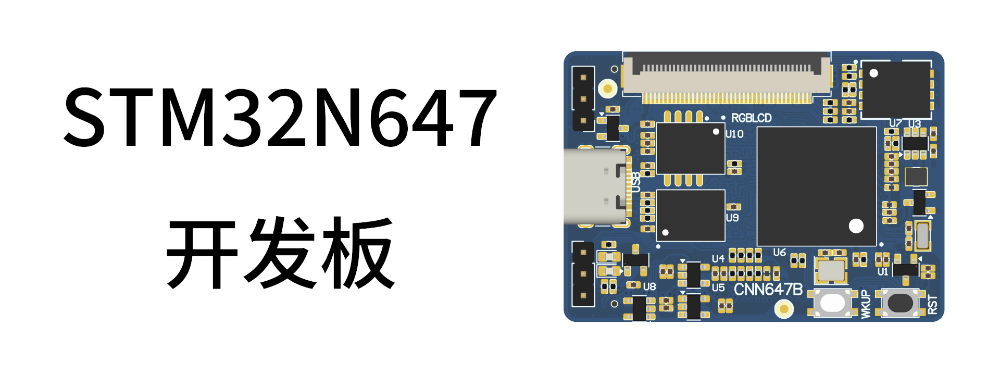

# 目录

- **入门指南**
  - [产品验收](./start-guide/product-acceptance.md)
  - [配套资料下载](./start-guide/download.md)
  - [STM32N647 开发板介绍](./start-guide/stm32n647-board-introduction.md)
  - [STM32N6 介绍](./start-guide/stm32n6-introduction.md)
  - **软件包**
    - [软件包介绍](./start-guide/software-package/software-package.md)
  - **开发环境搭建**
    - [STM32CubeProgrammer 软件安装](./start-guide/setup-development-environment/stm32cubeprogrammer-install.md)
    - [STM32CubeMX 软件安装](./start-guide/setup-development-environment/stm32cubemx-install.md)
    - [STM32CubeIDE 软件安装](./start-guide/setup-development-environment/stm32cubeide-install.md)
    - [STEdgeAI-Core 软件安装](./start-guide/setup-development-environment/stedgeai-core-install.md)
    - [CH340C 驱动安装](./start-guide/setup-development-environment/ch340c-driver-install.md)
  - **开发入门**
    - **开发工具初始化配置**
      - [STM32CubeMX](./start-guide/start-development/setup-development-tools/stm32cubemx.md)
      - [STM32CubIDE](./start-guide/start-development/setup-development-tools/stm32cubeide.md)
      - [STM32CubeProgrammer](./start-guide/start-development/setup-development-tools/stm32cubeprogrammer.md)
    - [开发流程 Step-by-Step](./start-guide/start-development/step-by-step.md)
  - [常见问题汇总（FAQ）](./start-guide/FAQ.md)