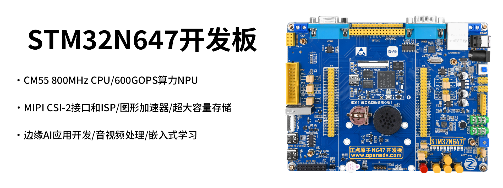

# 目录

- **入门指南**
  - [产品验收](./start-guide/product-acceptance.md)
  - [配套资料下载](./start-guide/download.md)
  - [STM32N647 开发板介绍](./start-guide/stm32n647-board-introduction.md)
  - [STM32N6 介绍](./start-guide/stm32n6-introduction.md)
  - **STM32N647 开发板软件包**
    - [软件包介绍](./start-guide/software-package/software-package.md)
  - **开发环境搭建**
    - [STM32CubeProgrammer 软件安装](./start-guide/setup-development-environment/stm32cubeprogrammer-install.md)
    - [STM32CubeMX 软件安装](./start-guide/setup-development-environment/stm32cubemx-install.md)
    - [STM32CubeIDE 软件安装](./start-guide/setup-development-environment/stm32cubeide-install.md)
    - [STEdgeAI-Core 软件安装](./start-guide/setup-development-environment/stedgeai-core-install.md)
    - [CH340C 驱动安装](./start-guide/setup-development-environment/ch340c-driver-install.md)
  - **开发入门**
    - **开发工具初始化配置**
      - [STM32CubeMX](./start-guide/start-development/setup-development-tools/stm32cubemx.md)
      - [STM32CubIDE](./start-guide/start-development/setup-development-tools/stm32cubeide.md)
      - [STM32CubeProgrammer](./start-guide/start-development/setup-development-tools/stm32cubeprogrammer.md)
      - [STEdgeAI-Core](./start-guide/start-development/setup-development-tools/stedgeai-core.md)
    - [开发流程 Step-by-Step](./start-guide/start-development/step-by-step.md)
  - [常见问题汇总（FAQ）](./start-guide/FAQ.md)
- **基础例程**
  - [LED](./basic-examples/led.md)
  - [Buzzer](./basic-examples/buzzer.md)
  - [Button](./basic-examples/button.md)
  - [Button EXTI](./basic-examples/button-exti.md)
  - [Serial](./basic-examples/serial.md)
  - [IWDG](./basic-examples/iwdg.md)
  - [WWDG](./basic-examples/wwdg.md)
  - [Basic Timer](./basic-examples/basic-timer.md)
  - [General Purpose Timer](./basic-examples/general-purpose-timer.md)
  - [Advanced Control Timer](./basic-examples/advanced-control-timer.md)
  - [TPAD](./basic-examples/tpad.md)
  - [OLED](./basic-examples/oled.md)
  - [MPU](./basic-examples/mpu.md)
  - [TFTLCD](./basic-examples/tftlcd.md)
  - [RGBLCD](./basic-examples/rgblcd.md)
  - [USMART](./basic-examples/usmart.md)
  - [RTC](./basic-examples/rtc.md)
  - [RNG](./basic-examples/rng.md)
  - [DMA](./basic-examples/dma.md)
  - [ADC](./basic-examples/adc.md)
  - [DTS](./basic-examples/dts.md)
  - [PWMDAC](./basic-examples/pwmdac.md)
  - [EEPROM](./basic-examples/eeprom.md)
  - [AP3216C](./basic-examples/ap3216c.md)
  - [RS485](./basic-examples/rs485.md)
  - [FDCAN](./basic-examples/fdcan.md)
  - [Touch](./basic-examples/touch.md)
  - [Remote](./basic-examples/remote.md)
  - [DS18B20](./basic-examples/ds18b20.md)
  - [DHT11](./basic-examples/dht11.md)
  - [QMI8658A](./basic-examples/qmi8658a.md)
  - [QMC6308](./basic-examples/qmc6308.md)
  - [Wireless](./basic-examples/wireless.md)
  - [WS2812B](./basic-examples/ws2812b.md)
  - [Sensor](./basic-examples/sensor.md)
  - [Memory Management](./basic-examples/memory-management.md)
  - [SD NAND](./basic-examples/sd-nand.md)
  - [SD Card](./basic-examples/sd-card.md)
  - [FatFs](./basic-examples/fatfs.md)
  - [Chinese Show](./basic-examples/chinese-show.md)
  - [Picture Show](./basic-examples/picture-show.md)
  - [JPEG](./basic-examples/jpeg.md)
  - [Camera](./basic-examples/camera.md)
  - [Music Player](./basic-examples/music-player.md)
  - [Recorder](./basic-examples/recorder.md)
  - [SPDIF](./basic-examples/spdif.md)
  - [Video Player](./basic-examples/video-player.md)
  - [FPU](./basic-examples/fpu.md)
  - [DSP](./basic-examples/dsp.md)
  - [Handwriting Recognition](./basic-examples/handwriting-recognition.md)
  - [T9 Pinyin](./basic-examples/t9-pinyin.md)
  - [USB Device Card Reader](./basic-examples/usb-device-card-reader.md)
  - [USB Device Sound Card](./basic-examples/usb-device-sound-card.md)
  - [USB Device Virtual Serial](./basic-examples/usb-device-virtual-serial.md)
  - [USB Host Disk](./basic-examples/usb-host-disk.md)
  - [USB Host HID](./basic-examples/usb-host-hid.md)
  - [ThreadX Thread](./basic-examples/threadx-thread.md)
  - [ThreadX Semaphore](./basic-examples/threadx-semaphore.md)
  - [ThreadX Timer](./basic-examples/threadx-timer.md)
  - [ThreadX Queue](./basic-examples/threadx-queue.md)
  - [NetXDuo TCP Client](./basic-examples/netxduo-tcp-client.md)
- **进阶例程**
  - [AI People Detection](./advanced-examples/ai-people-detection.md)
  - [AI Image Classification](./advanced-examples/ai-image-classification.md)
  - [AI Instance Segmentation](./advanced-examples/ai-instance-segmentation.md)
  - [AI Multi Pose Estimation](./advanced-examples/ai-multi-pose-estimation.md)
  - [AI Hand Landmarks](./advanced-examples/ai-hand-landmarks.md)