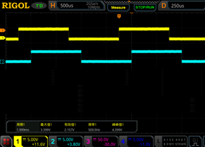

# 高级定时器实验

Advanced Control Timer

## 前言

本章我们主要来学习高级定时器， STM32N647有2个高级定时器（TIM1和TIM8）。我们将通过四个实验来学习高级定时器的各个功能，分别是高级定时器输出指定个数PWM实验、高级定时器输出比较模式实验、高级定时器互补输出带死区控制实验和高级定时器PWM输入模式实验。

本章内容包含了以下四个部分：

1.高级定时器输出指定个数PWM实验：通过TIM1_CH1(PC6)输出PWM，按一下按键KEY1，就会输出5个PWM信号，可以用DS100示波器辅助查看。

2.高级定时器输出比较模式实验：使用输出比较模式的翻转功能，通过定时器1的2路通道输出占空比固定为50%、相位分别是25%和50%的PWM(PC6和PD7)。

3.高级定时器互补输出带死区控制实验：利用TIM1_CH1(PC6)输出70%占空比的PWM，它的互补输出通道(PE8)则是输出30%占空比的PWM。刹车功能，当给刹车输入引脚(PE15)输入高电平时，进行刹车，即PC6和PE8停止输出PWM。

4.高级定时器PWM输入模式实验：首先通过TIM3_CH1(PC6)输出PWM波。然后把PC6输出的PWM波用杜邦线接入PD6（定时器1通道1），最后通过串口打印PWM波的脉宽和频率等信息。LED1闪烁来提示程序正在运行。

本实验对应的工程文件夹为：`<STM32N647 开发板软件包路径>/Projects/10_Advanced_Control_Timer`。

## 实验准备

1. 将 STM32N647 开发板软件包中提供的示例 FSBL 固件烧录到 STM32N647 开发板上。

:::tip[FSBL 烧录说明]

本实验使用的 FSBL 为 STM32N647 开发板软件包中的示例 FSBL，请根据 [**示例 FSBL介绍**](../start-guide/software-package/software-package.md#fsbl) 中的说明烧录对应 `fsbl.hex`。

不同的的实验中，若使用相同的 FSBL，则无需重复烧录。

:::

2. 将工程文件夹下 `Binary` 目录下的 `appli.hex` 依次烧录到 STM32N647 开发板上。

:::tip[烧录说明]

烧录顺序不影响烧录结果。

[**使用 `STM32CubeProgrammer` 烧录**](../start-guide/start-development/step-by-step.md#step-3-使用-stm32cubeprogrammer-烧录)。

:::

3. 若是 `高级定时器 PWM 输入模式实验`，则使用 USB Type-C 数据线将串口调试助手的物理机与 STM32N647 开发板的 `USB UART` 接口连接。

4. 将 STM32N647 开发板的 BOOT 模式配置为 `Flash boot` 模式

:::tip[STM32N647 开发板 BOOT 模式配置说明]

通过 STM32N647 开发板 `P6` 的跳线帽配置其 BOOT 模式：

`Development boot`：B1 接 3V3

`Flash boot`：B0、B1 都接 GND

:::

5. 将对应接口的电源线接入 STM32N647 开发板底板的 USB Type-C 接口或 DC 接口，为其进行供电，并将 `K1` 自锁开关切换到开启状态。

## 实验现象

高级定时器输出指定个数PWM实验：我们每按一下按键KEY1，就会输出5个PWM。下面我们使用正点原子DS100手持数字示波器，把PC6引脚的波形截获，如下图所示：


由图可知频率为2Hz，大家可以自行测量。

高级定时器输出比较模式实验：下下载代码后，可以看到LED1在闪烁，说明程序已经正常在跑了。 我们需要借助示波器观察PC6和PD7引脚PWM输出的情况，我们已经把示波器的显示内容截图出来，如下图所示：



高级定时器互补输出带死区控制实验：载代码后，可以看到LED1在闪烁，说明程序已经正常在跑了。 我们需要借助示波器观察PC6正常输出和PE8互补输出PWM的情况.


死区时间计算可分为以下两步：

第一步：通过CKD[1:0]位确定tDTS。根据CKD[1:0]位的描述，可以得到下面的式子：

```c
tDTS=2^CKD[1:0]/Tclk=2^0/400000000=2.5ns
```

死区时间=100*tDTS=250ns，大家可以用示波器测试下，


如果将PE15接入高电平后，PC6和PE8停止输出PWM。

高级定时器PWM输入模式实验：下载代码后，可以看到LED1在闪烁，说明程序已经正常在跑了，我们再打开串口调试助手，选择对应的串口端口。然后用杜邦线把PC6引脚连接到PD6引脚，就可以看到串口助手不断打印PWM波的信息

