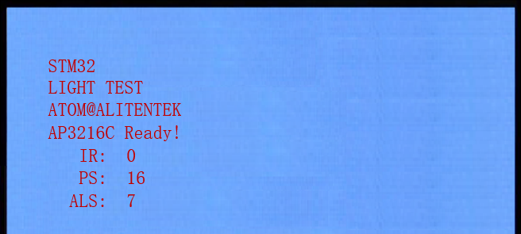

# 光环境传感器实验

AP3216C

## 前言

上一章，我们介绍了IIC驱动24C02，本章我们将向大家介绍如何使用IIC来驱动光环境传感器。在本章中，我们将使用STM32N647的IIC接口，来驱动AP3216C，从而检测环境光强度（ALS）、接近距离（PS）和红外线强度（IR）等环境参数。

例程开机的时候先检测AP3216C是否存在，如检测不到AP3216C，则在LCD屏幕上面显示报错信息。如果检测到AP3216C，则显示正常，并在主循环里面，循环读取ALS+PS+IR的传感器数据，并显示在LCD屏幕上面。同时，DS0闪烁，提示程序正在运行。

本实验对应的工程文件夹为：`<STM32N647 开发板软件包路径>/Projects/24_AP3216C`。

## 实验准备

1. 将 STM32N647 开发板软件包中提供的示例 FSBL 固件烧录到 STM32N647 开发板上。

:::tip[FSBL 烧录说明]

本实验使用的 FSBL 为 STM32N647 开发板软件包中的示例 FSBL，请根据 [**示例 FSBL介绍**](../start-guide/software-package/software-package.md#fsbl) 中的说明烧录对应 `fsbl.hex`。

不同的的实验中，若使用相同的 FSBL，则无需重复烧录。

:::

2. 将工程文件夹下 `Binary` 目录下的 `appli.hex` 依次烧录到 STM32N647 开发板上。

:::tip[烧录说明]

烧录顺序不影响烧录结果。

[**使用 `STM32CubeProgrammer` 烧录**](../start-guide/start-development/step-by-step.md#step-3-使用-stm32cubeprogrammer-烧录)。

:::

3. 将 LCD 通过 FPC 延长线接入 STM32N647 开发板核心板的 `RGBLCD` 接口。

:::info[LCD 适配说明]

本实验例程仅支持 `正点原子 RGB 触摸屏模块`。

:::

4. 将 STM32N647 开发板的 BOOT 模式配置为 `Flash boot` 模式

:::tip[STM32N647 开发板 BOOT 模式配置说明]

通过 STM32N647 开发板 `P6` 的跳线帽配置其 BOOT 模式：

`Development boot`：B1 接 3V3

`Flash boot`：B0、B1 都接 GND

:::

5. 将对应接口的电源线接入 STM32N647 开发板底板的 USB Type-C 接口或 DC 接口，为其进行供电，并将 `K1` 自锁开关切换到开启状态。

## 实验现象

将程序下载到开发板后，可以看到LED0不停的闪烁，提示程序已经在运行了。LCD显示的内容如下图所示：

我们可以用手遮挡/靠近AP3216C传感器，可以看到三个传感器的数据变化，说明我们的代码是工作正常的。