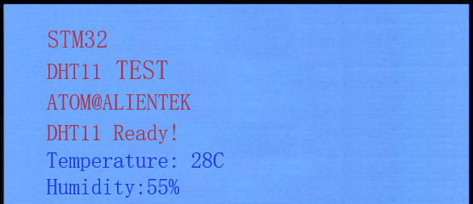

# DHT11 数字温湿度传感器实验

DHT11

## 前言

本章，我们将介绍数字温湿度传感器DHT11的使用，与前一章的温度传感器相比，该传感器不但能测温度，还能测湿度。我们将学习如何获取DHT11传感器的温湿度数据，并把数据显示在LCD上。

本实验开机的时候先检测是否有DHT11存在，如果没有，则提示错误。只有在检测到DHT11之后才开始读取温湿度值，并显示在LCD上，如果发现了DHT11，则程序每隔100ms左右读取一次数据，并把温湿度显示在LCD上。LED0闪烁，提示程序运行。

本实验对应的工程文件夹为：`<STM32N647 开发板软件包路径>/Projects/30_DHT11`。

## 实验准备

1. 将 STM32N647 开发板软件包中提供的示例 FSBL 固件烧录到 STM32N647 开发板上。

:::tip[FSBL 烧录说明]

本实验使用的 FSBL 为 STM32N647 开发板软件包中的示例 FSBL，请根据 [**示例 FSBL介绍**](../start-guide/software-package/software-package.md#fsbl) 中的说明烧录对应 `fsbl.hex`。

不同的的实验中，若使用相同的 FSBL，则无需重复烧录。

:::

2. 将工程文件夹下 `Binary` 目录下的 `appli.hex` 依次烧录到 STM32N647 开发板上。

:::tip[烧录说明]

烧录顺序不影响烧录结果。

[**使用 `STM32CubeProgrammer` 烧录**](../start-guide/start-development/step-by-step.md#step-3-使用-stm32cubeprogrammer-烧录)。

:::

3. 将 LCD 通过 FPC 延长线接入 STM32N647 开发板核心板的 `RGBLCD` 接口。

:::info[LCD 适配说明]

本实验例程仅支持 `正点原子 RGB 触摸屏模块`。

:::

4. 将 DHT11 传感器模块接入 STM32N647 开发板的 `U11` 接口。

5. 将 STM32N647 开发板的 BOOT 模式配置为 `Flash boot` 模式

:::tip[STM32N647 开发板 BOOT 模式配置说明]

通过 STM32N647 开发板 `P6` 的跳线帽配置其 BOOT 模式：

`Development boot`：B1 接 3V3

`Flash boot`：B0、B1 都接 GND

:::

6. 将对应接口的电源线接入 STM32N647 开发板底板的 USB Type-C 接口或 DC 接口，为其进行供电，并将 `K1` 自锁开关切换到开启状态。

## 实验现象

假定DHT11传感器已经接上去正确的位置，将程序下载到开发板后，可以看到LED0不停的闪烁，提示程序已经在运行了。LCD显示当前的温湿度值的内容如下图所示：

至此，本章实验结束。大家可以将本章通过DHT11读取到的温度值，和前一章的通过DS18B20读取到的温度值对比一下，看看哪个更准确？