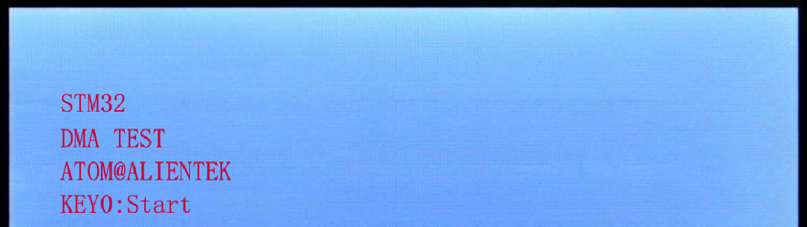
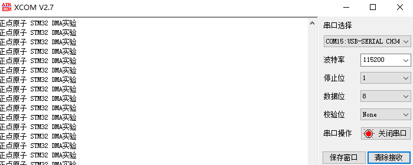

# DMA

DMA实验

## 前言

本章，我们将介绍STM32N647的DMA。我们将利用DMA来实现串口数据传送，并在LCD模块上显示当前的传送进度。

每次按下按键KEY0，串口1就会以DMA方式发送数据，同时在LCD上面显示传送进度。打开串口调试助手，可以收到DMA发送的内容。LED0闪烁用于提示程序正在运行。

## 实验准备

1. 编写成功后，切换BOOT1跳线帽至3.3V处，便可进行程序下载，下载完之后，将BOOT1跳线帽切换回GND处，对开发板重新上电。

## 实验现象

将程序下将程序下载到开发板后，可以看到LED0不停的闪烁，提示程序已经在运行了。LCD显示的内容如下图所示：

我们打开串口调试助手，然后按KEY0，可以看到串口显示如下图所示：

至此，我们整个DMA实验就结束了，希望大家通过本章的学习，掌握STM32N647的DMA使用。DMA是个非常好的功能，它不但能减轻CPU负担，还能提高数据传输速度，合理的应用DMA，往往能让你的程序设计变得简单。
