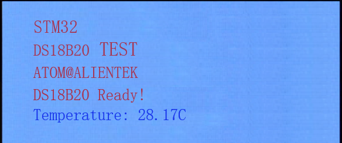

# DS18B20

DS18B20数字温度传感器实验

## 前言

本章，我们将介绍STM32如何读取外部温度传感器的温度，来得到较为准确的环境温度。我们将学习单总线技术，通过它来实现STM32和外部温度传感器DS18B20的通信，并把从温度传感器得到的温度显示在LCD上。

本实验开机的时候先检测是否有DS18B20存在，如果没有，则提示错误。只有在检测到DS18B20之后才开始读取温度并显示在LCD上，如果发现了DS18B20，则程序每隔100ms左右读取一次数据，并把温度显示在LCD上。 LED0闪烁用于提示程序正在运行。

## 实验准备

1. 将一个DS18B20传感器插入开发板的U11处接口，注意弧形面朝外。
1. 编译成功后，切换BOOT1跳线帽至3.3V处，便可进行程序下载，下载完之后，将BOOT1跳线帽切换回GND处，对开发板重新上电。

## 实验现象

假定DS18B20传感器已经接上去正确的位置，将程序下载到开发板后，可以看到LED0不停的闪烁，提示程序已经在运行了。LCD显示当前的温度值的内容如下图所示：

该程序还可以读取并显示负温度值，具备零下温度条件可以测试一下。
