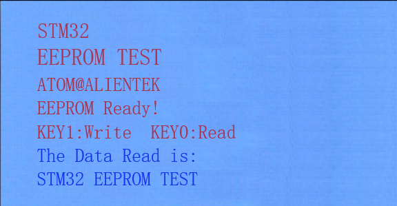

# EEPROM

EEPROM实验

## 前言

本章，我们将介绍如何使用STM32N647的硬件IIC，并实现和24C02之间的双向通信，对24C02进行数据读写，并把结果显示在LCD模块上。

本章实验每按下KEY_UP，MCU通过IIC总线向24C02写入数据，通过按下KEY1来控制24C02读取数据。同时在LCD上面显示相关信息。LED0闪烁用于提示程序正在运行。

## 实验准备

1. 编写成功后，切换BOOT1跳线帽至3.3V处，便可进行程序下载，下载完之后，将BOOT1跳线帽切换回GND处，对开发板重新上电。

## 实验现象

将程序下载到开发板后，可以看到LED0不停的闪烁，提示程序已经在运行了，先按下KEY1写入数据，然后再按KEY0读取数据，最终LCD显示的内容如下图所示：

至此，我们整个IIC实验就结束了，本章内容比较多，需要大家花多点时间去理解，一定要自己去用一下IIC通信协议。市面上很多器件都是具有IIC通信接口的，可以尝试去驱动它们，这样才能学以致用。
