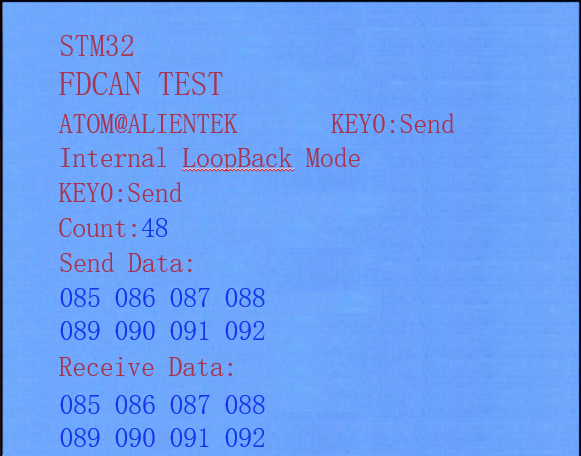
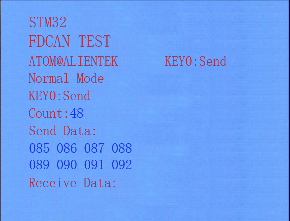
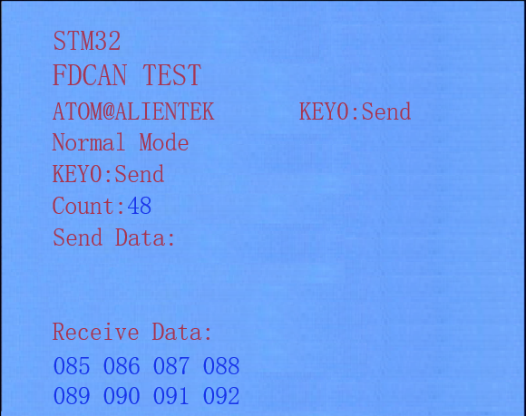

# FDCAN 通讯实验

FDCAN

## 前言

本章我们将向大家介绍如何使用 STM32N647自带的FDCAN控制器，相比于STM32以前自带的CAN，FDCAN性能更为强大， FDCAN每帧数据最大可以到64字节，FDCAN速度远超CAN的1Mbps，能够达到8Mbps甚至更高。本章我们就来实现两个开发板之间的FDCAN通讯，并将结果显示在LCD模块上。

本章实验内容包含了以下两个部分：

1.FDCAN回环模式实验：需要1个开发板，通过KEY0控制数据发送，接着查询是否有数据接收到，假如接收到数据，就将接收到的数据显示在LCD模块上

2.FDCAN正常模式实验：需要2个开发板，并且将他们的CAN接口对接起来，然后一个开发板发送数据，另外一个开发板将接收到的数据显示在LCD模块上。

本实验对应的工程文件夹为：`<STM32N647 开发板软件包路径>/Projects/26_FDCAN`。

## 实验准备

1. 将 STM32N647 开发板软件包中提供的示例 FSBL 固件烧录到 STM32N647 开发板上。

:::tip[FSBL 烧录说明]

本实验使用的 FSBL 为 STM32N647 开发板软件包中的示例 FSBL，请根据 [**示例 FSBL介绍**](../start-guide/software-package/software-package.md#fsbl) 中的说明烧录对应 `fsbl.hex`。

不同的的实验中，若使用相同的 FSBL，则无需重复烧录。

:::

2. 将工程文件夹下 `Binary` 目录下的 `appli.hex` 依次烧录到 STM32N647 开发板上。

:::tip[烧录说明]

烧录顺序不影响烧录结果。

[**使用 `STM32CubeProgrammer` 烧录**](../start-guide/start-development/step-by-step.md#step-3-使用-stm32cubeprogrammer-烧录)。

:::

3. 将 LCD 通过 FPC 延长线接入 STM32N647 开发板核心板的 `RGBLCD` 接口。

:::info[LCD 适配说明]

本实验例程仅支持 `正点原子 RGB 触摸屏模块`。

:::

4. 若是 `FDCAN 正常模式实验`，则需要将两块 STM32N647 开发板的 CAN 接口相连接。

5. 将 STM32N647 开发板的 BOOT 模式配置为 `Flash boot` 模式

:::tip[STM32N647 开发板 BOOT 模式配置说明]

通过 STM32N647 开发板 `P6` 的跳线帽配置其 BOOT 模式：

`Development boot`：B1 接 3V3

`Flash boot`：B0、B1 都接 GND

:::

6. 将对应接口的电源线接入 STM32N647 开发板底板的 USB Type-C 接口或 DC 接口，为其进行供电，并将 `K1` 自锁开关切换到开启状态。

## 实验现象

FDCAN回环模式实验：代码下载成功后，伴随LED0的不停闪烁，提示程序在运行。在回环模式下，按下KEY0就可以在LCD模块上面看到自发自收的数据，如下图所示：

FDCAN正常模式实验：下载代码后，按下KEY0后可以发送数据。正常模式下，需要两块开发板，两个开发板CAN端子的CAN_L和CAN_L，CAN_H和CAN_H连接，当开发板A按下KEY0时，LCD显示发送的数据，如下图所示：

此时开发板BReceive Data处显示开发板A发送的数据，大家可以多次测试并对比，如下图所示：

