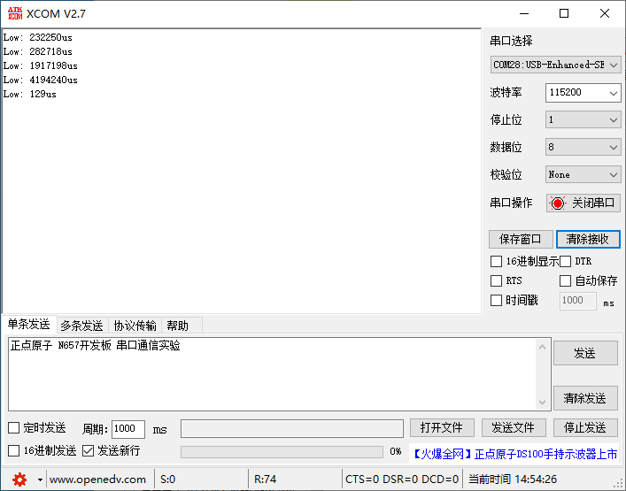

# General Purpose Timer

通用定时器实验

## 前言

本章我们主要来学习通用定时器，上一章我们知道STM32N647有13个通用定时器（TIM2-TIM5，TIM9-TIM17）。我们将通过四个实验来学习通用定时器的各个功能，分别是通用定时器中断实验、通用定时器PWM输出实验、通用定时器输入捕获实验和通用定时器脉冲计数实验。

本章内容包含了以下四个部分：

1.通用定时器中断实验：LED1用来指示程序正在运行，200ms翻转一次。LED0在定时器中断中翻转，500ms进入中断一次。

2.通用定时器PWM输出实验：使用TIM3通道1输出PWM，TIM3通道1对应的PC6，可以通过示波器接入PC6查看PWM输出。

3.通用定时器输入捕获实验：使用TIM3_CH1来做输入捕获，捕获PC6上的低电平脉宽，并将脉宽时间通过串口打印出来，通过按KEY0按键，模拟输入低电平，例程中能测试的最长低电平脉宽时间为：4194240us。

4.通用定时器脉冲计数实验：使用TIM3_CH1做输入捕获，我们将捕获PC6上的低电平脉宽，并对脉宽进行计数，通过串口打印出来。大家可以通过按KEY0按键，输入低电平脉冲，通过按KEY1重设当前计数。LED1闪烁，提示程序运行。

本实验对应的工程文件夹为：`<STM32N647 开发板软件包路径>/Projects/09_General_Purpose_Timer`。

## 实验准备

1. 将 STM32N647 开发板软件包中提供的示例 FSBL 固件烧录到 STM32N647 开发板上。

:::tip[FSBL 烧录说明]

本实验使用的 FSBL 为 STM32N647 开发板软件包中的示例 FSBL，请根据 [**示例 FSBL介绍**](../start-guide/software-package/software-package.md#fsbl) 中的说明烧录对应 `fsbl.hex`。

不同的的实验中，若使用相同的 FSBL，则无需重复烧录。

:::

2. 将工程文件夹下 `Binary` 目录下的 `appli.hex` 依次烧录到 STM32N647 开发板上。

:::tip[烧录说明]

烧录顺序不影响烧录结果。

[**使用 `STM32CubeProgrammer` 烧录**](../start-guide/start-development/step-by-step.md#step-3-使用-stm32cubeprogrammer-烧录)。

:::

3. 若是 `通用定时器输入捕获实验` 或 `通用定时器脉冲计数实验`，则使用 USB Type-C 数据线将串口调试助手的物理机与 STM32N647 开发板的 `USB UART` 接口连接。

4. 将 STM32N647 开发板的 BOOT 模式配置为 `Flash boot` 模式

:::tip[STM32N647 开发板 BOOT 模式配置说明]

通过 STM32N647 开发板 `P6` 的跳线帽配置其 BOOT 模式：

`Development boot`：B1 接 3V3

`Flash boot`：B0、B1 都接 GND

:::

5. 将对应接口的电源线接入 STM32N647 开发板底板的 USB Type-C 接口或 DC 接口，为其进行供电，并将 `K1` 自锁开关切换到开启状态。

## 实验现象

通用定时器中断实验：下载代码后，可以看到LED1不停闪烁（每400ms一个周期），而LED0也是不停的闪烁，但是闪烁时间较LED1慢（每1s一个周期）。

通用定时器PWM输出实验：下载代码后，可通过示波器查看到变化的PWM输出，假设当比较值固定为200时，占空比 = CCR1 / (arr+1) = 200/500=40%。可以看到输出比较极性为低和输出比较极性为高的占空比正好反过来，如下图所示：

我们默认设置的是输出比较极性低，如黄色波形所示。

通用定时器输入捕获实验：下载代码后，按下KEY0，可以看到XCOM输入低电平脉宽时间，我们可以通过久按测试，上位机输出不同的低电平脉宽时间，单次采集时间最高为4194240us。

通用定时器脉冲计数实验：下载代码后，按下KEY0，开发板会统计按下次数并通过串口输出，如果按下KEY1，会对统计次数清0，如下图所示：查看到按下次数

