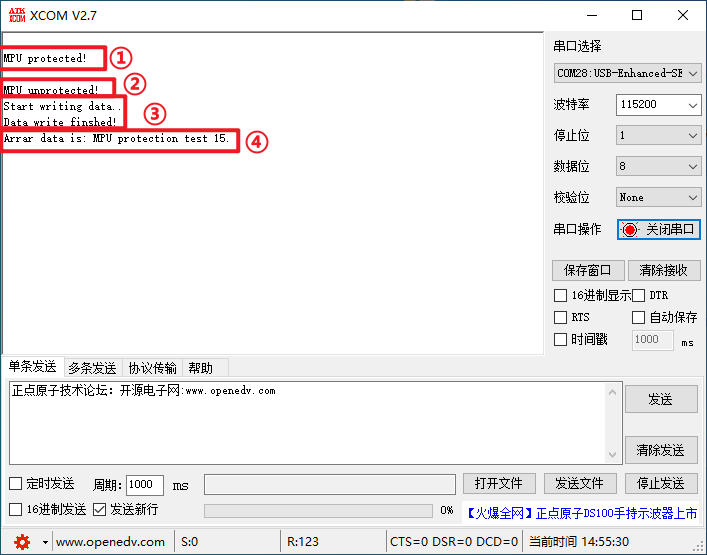

# MPU

内存保护(MPU)实验

## 前言

STM32的Cortex M4（STM32F3/F4系列）、Cortex M7（STM32F7/H7/H7RS系列）系列、Cortex M55（STM32N6）的产品，都带有内存保护单元（memory protection unit），简称：MPU。使用MPU可以设置不同存储区域的存储器访问特性（如只支持特权访问或全访问）和存储器属性（如可缓存、可共享），从而提高嵌入式系统的健壮性，使系统更加安全。接下来，我们将以STM32N647为例，给大家介绍内存保护单元（MPU）的使用。

本实验使用STM32N647自带的MPU功能，对一个特定的内存空间（地址：0x341FFC00）进行写访问保护。开机时，串口调试助手显示：MPU protected，表示默认是有写保护的。按下WK_UP，可以关闭内存保护，此时串口调试助手显示：MPU unprotected，按KEY0可以往数组里面写数据，按KEY1，可以读取数组里面的数据。如果不关闭内存写保护，直接按下KEY0写数据，会无法写入，导致程序出现异常。LED0用于提示程序正在运行，所有信息都是通过串口1输出，需要用串口调试助手查看。

## 实验准备

1. 编写成功后，切换BOOT1跳线帽至3.3V处，便可进行程序下载，下载完之后，将BOOT1跳线帽切换回GND处，对开发板重新上电。
1. 将开发板的USB_UART端连接电脑，然后打开串口调试助手XCOM，连接上开发板对应的端口。

## 实验现象

下载代码后，LED0不停的闪烁，提示程序已经在运行了。串口助手首先提示MPU保护开启，我们按下WK_UP后，即可关闭内存保护，这时才可以正常往原内存保护区域写入数据，按下KEY0，可以写入数据，按下KEY1，可以读取数据，如图所示： 

​	①上电默认开启内存保护，内存保护区域可设定读写权限

​	②按下WK_UP，可关闭内存保护。实验例程未关闭内存保护，无法通过按下KEY0写入数据

​	③按下KEY0，写入数据

​	④按下KEY1，读取数据
