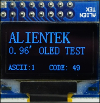

# OLED

OLED显示实验

## 前言

本章我们来学习使用OLED液晶显示屏，在开发板上我们预留了OLED模块接口，需要准备一个OLED显示模块。下面我们一起来点亮OLED，并实现ASCII字符的显示。

使用8080并口模式驱动或者使用4线SPI串口模式，驱动OLED模块，不停的显示ASCII码和码值。LED0闪烁，提示程序运行。

本实验对应的工程文件夹为：`<STM32N647 开发板软件包路径>/Projects/12_OLED`。

## 实验准备

1. 将 STM32N647 开发板软件包中提供的示例 FSBL 固件烧录到 STM32N647 开发板上。

:::tip[FSBL 烧录说明]

本实验使用的 FSBL 为 STM32N647 开发板软件包中的示例 FSBL，请根据 [**示例 FSBL介绍**](../start-guide/software-package/software-package.md#fsbl) 中的说明烧录对应 `fsbl.hex`。

不同的的实验中，若使用相同的 FSBL，则无需重复烧录。

:::

2. 将工程文件夹下 `Binary` 目录下的 `appli.hex` 依次烧录到 STM32N647 开发板上。

:::tip[烧录说明]

烧录顺序不影响烧录结果。

[**使用 `STM32CubeProgrammer` 烧录**](../start-guide/start-development/step-by-step.md#step-3-使用-stm32cubeprogrammer-烧录)。

:::

3. 将 OLED 模块通过 FPC 延长线接入 STM32N647 开发板的 `OLED/CAMERA` 接口。

4. 将 STM32N647 开发板的 BOOT 模式配置为 `Flash boot` 模式

:::tip[STM32N647 开发板 BOOT 模式配置说明]

通过 STM32N647 开发板 `P6` 的跳线帽配置其 BOOT 模式：

`Development boot`：B1 接 3V3

`Flash boot`：B0、B1 都接 GND

:::

5. 将对应接口的电源线接入 STM32N647 开发板底板的 USB Type-C 接口或 DC 接口，为其进行供电，并将 `K1` 自锁开关切换到开启状态。

## 实验现象

下载代码后，LED0不停的闪烁，提示程序已经在运行了。同时OLED模块显示ASCII字符集等信息，如图所示： 

OLED显示了三种尺寸的字符：24 * 12（ALIENTEK）、16 * 8（0.96’ OLED TEST）和12 * 6（剩下的内容）。说明我们的实验是成功的，实现了三种不同尺寸ASCII字符的显示，在最后一行不停的显示ASCII字符以及其码值。

通过这一章的学习，我们学会了正点原子 OLED模块的使用，在调试代码的时候，又多了一种显示信息的途径，在以后的程序编写中，大家可以好好利用。