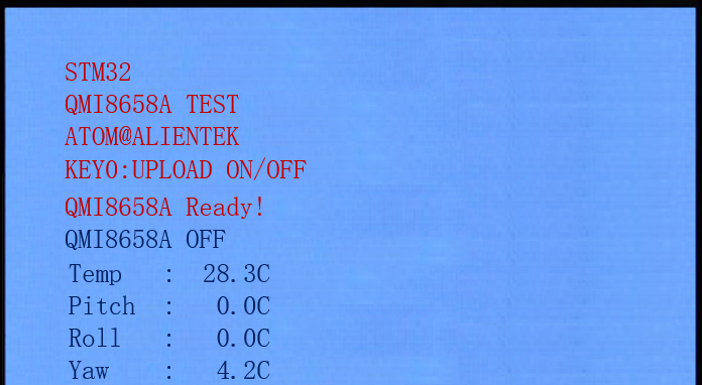
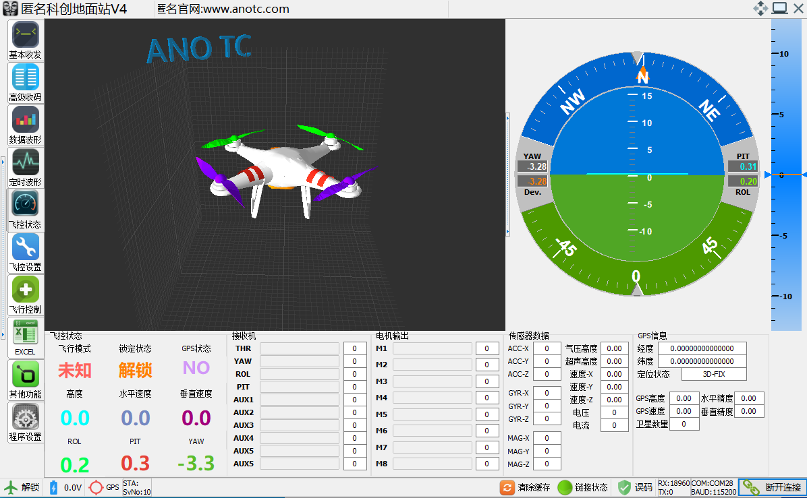

# QMI8658A

QMI8658A六轴传感器实验

## 前言

本章，我们将介绍一款高性价比六轴（三轴角速度（陀螺仪）+三轴加速度）传感器：QMI8658A，该传感器可广泛用于四轴、平衡车和空中鼠标等设计，性价比极高，具有非常广泛的应用范围。正点原子STM32N647开发板自带了QMI8658A传感器。本章我们将使用STM32N647来驱动QMI8658A，读取其原始数据，并利用MPL库实现姿态解算，结合匿名四轴上位机软件和LCD显示，教大家如何使用这款功能强大的六轴传感器。

本实验采用STM32N647的硬件IIC接口连接QMI8658A（IIC），本章实验功能简介：程序先初始化QMI8658A，然后利用imu姿态解算的计算，最后，在死循环里面不停读取：温度传感器、加速度传感器、陀螺仪、姿态解算后的欧拉角等数据，通过串口上报给上位机（温度不上报），利用上位机软件（ANO_TC匿名科创地面站v4.exe），可以实时显示QMI8658A的传感器状态曲线，并显示3D姿态，可以通过KEY0按键开启/关闭数据上传功能。同时，在LCD模块上面显示温度和欧拉角等信息。DS0来指示程序正在运行。

## 实验准备

1. 编译成功后，切换BOOT1跳线帽至3.3V处，便可进行程序下载，下载完之后，将BOOT1跳线帽切换回GND处，对开发板重新上电。
1. 用一根Type-C数据线连接电脑和开发板的USB_UART端口，用于UART上传数据到匿名地面站，波特率为115200。

## 实验现象

将程序下载到开发板后，可以看到LCD显示的内容如下图所示：

屏幕显示了QMI8658A的温度、俯仰角（Pitch）、横滚角（Roll）和航向角（Yaw）的数值。然后，我们可以晃动开发板，看看各角度的变化。

另外，模块默认是关闭状态，通过按下KEY0可以开启或关闭数据上报，在开启状态下，我们可以打开：ANO_TC匿名科创地面站v4.exe这个软件，接收STM32N647上传的数据，从而图形化显示飞行姿态，

