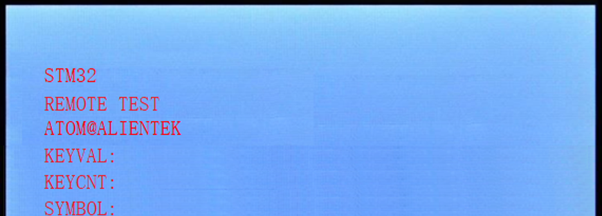
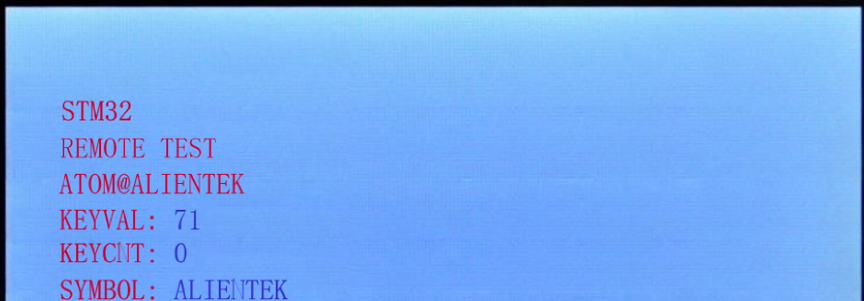

# Remote

红外遥控器实验

## 前言

本章，我们将介绍STM32对红外遥控器的信号解码。STM32板子上标配的红外接收头和一个小巧的红外遥控器。我们将利用STM32的输入捕获功能，解码开发板标配的红外遥控器的编码信号，并将编码后的键值在LCD模块中显示出来。

本实验开机在LCD上显示一些信息之后，即进入等待红外触发，如过接收到正确的红外信号，则解码，并在LCD上显示键值和所代表的意义，以及按键次数等信息。LED0闪烁用于提示程序正在运行。

## 实验准备

1. 编译成功后，切换BOOT1跳线帽至3.3V处，便可进行程序下载，下载完之后，将BOOT1跳线帽切换回GND处，对开发板重新上电。
1. 准备开发板配套的红外遥控器。

## 实验现象

将程序下载到开发板后，可以看到LED0不停的闪烁，提示程序已经在运行了。LCD显示的内容如下图所示：

此时我们通过遥控器按下不同的按键，则可以看到LCD上显示了不同按键的键值以及按键次数和对应的遥控器上的符号。LCD显示的内容如下图所示：

