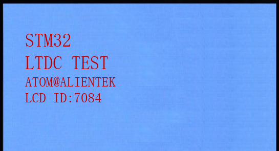

# RGBLCD

LTDC LCD(RGB屏)实验

## 前言

在前面，我们介绍了TFTLCD模块（MCU屏）的使用，但是高分辨率的屏幕（超过800*480），一般都没有MCU屏接口，而是使用RGB接口的，这种接口的屏幕，就需要用到STM32N647的LTDC来驱动了。在本章中，我们将使用STM32N647开发板核心板上的LCD接口（仅支持RGB屏，本章介绍RGB屏的使用），来点亮LCD，并实现ASCII字符和彩色的显示等功能，并在串口打印LCD ID，同时在LCD上面显示。

本实验利用STM32N647的LTDC接口来驱动RGB屏，RGBLCD模块的接口在核心板上，通过40P的FPC排线连接RGBLCD模块，实现RGBLCD模块的驱动和显示，下载成功后，按下复位之后，就可以看到RGBLCD模块不停的显示一些信息并不断切换底色。同时，屏幕上会显示LCD的ID。

## 实验准备

1. 断开电源，给开发板安装RGBLCD屏(RGBLCD屏接口位于核心板上)。
1. 编写成功后，切换BOOT1跳线帽至3.3V处，便可进行程序下载，下载完之后，将BOOT1跳线帽切换回GND处，对开发板重新上电。

## 实验现象

下载代码后，LED0不停的闪烁，提示程序已经在运行了。我们可以看到屏幕的背景是不停切换的，如图所示： 

