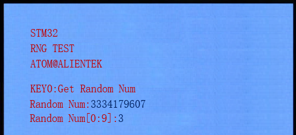

# RNG

随机数发生器实验

## 前言

本章，我们将介绍STM32N647的硬件随机数发生器。我们使用KEY0按键来获取硬件随机数，并且将获取到的随机数值显示在LCD上面。同时，使用LED0指示程序运行状态。

本实验使用STM32N647自带的硬件随机数生成器（RNG），获取随机数，并显示在LCD屏幕上。按KEY0可以获取一次随机数。同时程序自动获取0~9范围内的随机数，显示在屏幕上。LED0闪烁用于提示程序正在运行。

本实验对应的工程文件夹为：`<STM32N647 开发板软件包路径>/Projects/18_RNG`。

## 实验准备

1. 将 STM32N647 开发板软件包中提供的示例 FSBL 固件烧录到 STM32N647 开发板上。

:::tip[FSBL 烧录说明]

本实验使用的 FSBL 为 STM32N647 开发板软件包中的示例 FSBL，请根据 [**示例 FSBL介绍**](../start-guide/software-package/software-package.md#fsbl) 中的说明烧录对应 `fsbl.hex`。

不同的的实验中，若使用相同的 FSBL，则无需重复烧录。

:::

2. 将工程文件夹下 `Binary` 目录下的 `appli.hex` 依次烧录到 STM32N647 开发板上。

:::tip[烧录说明]

烧录顺序不影响烧录结果。

[**使用 `STM32CubeProgrammer` 烧录**](../start-guide/start-development/step-by-step.md#step-3-使用-stm32cubeprogrammer-烧录)。

:::

3. 将 LCD 通过 FPC 延长线接入 STM32N647 开发板核心板的 `RGBLCD` 接口。

:::info[LCD 适配说明]

本实验例程仅支持 `正点原子 RGB 触摸屏模块`。

:::

4. 将 STM32N647 开发板的 BOOT 模式配置为 `Flash boot` 模式

:::tip[STM32N647 开发板 BOOT 模式配置说明]

通过 STM32N647 开发板 `P6` 的跳线帽配置其 BOOT 模式：

`Development boot`：B1 接 3V3

`Flash boot`：B0、B1 都接 GND

:::

5. 将对应接口的电源线接入 STM32N647 开发板底板的 USB Type-C 接口或 DC 接口，为其进行供电，并将 `K1` 自锁开关切换到开启状态。

## 实验现象

将程序下载到开发板后，可以看到LED0不停的闪烁，提示程序已经在运行了。然后我们按下KEY0，就可以在屏幕上看到获取到的随机数。同时，就算不按KEY0，程序也会自动的获取0~9区间的随机数显示在LCD上面。如下图所示：

