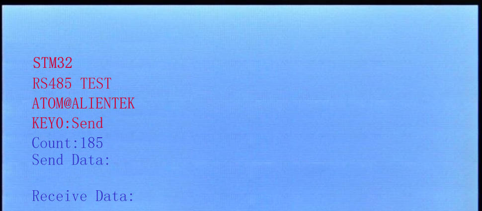
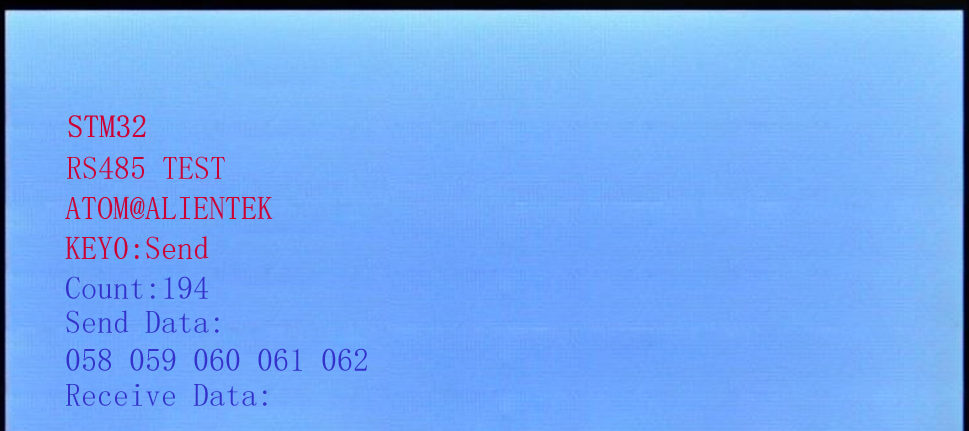
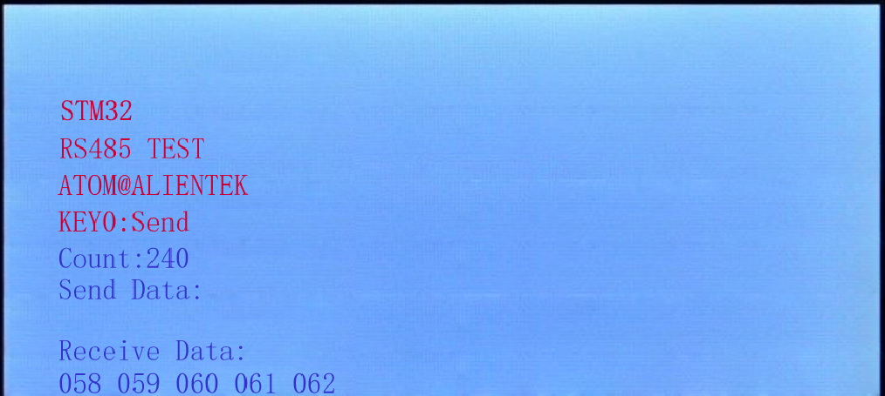

# RS485

RS485实验

## 前言

本章我们将向大家介绍如何使用STM32N647的串口实现485通信（半双工）。在本章中，我们将使用STM32N647的串口3来实现两块开发板之间的485通信，并将结果显示在LCD模块上。

经过前面的学习我们知道实际的RS485仍是串行通讯的一种电平传输方式，那么我们实际通讯时可以使用串口进行实际数据的收发处理，使用485转换芯片将串口信号转换为485的电平信号进行传输，本章，我们只需要配置好串口3，就可以实现正常的485通信了，串口3的配置和串口1基本类似。

本章将实现这样的功能：通过连接两个STM32N647的RS485接口，然后由KEY0控制发送，当按下一个开发板的KEY0的时候，就发送5个数据给另外一个开发板，并在两个开发板上分别显示发送的值和接收到的值。

## 实验准备

1. 准备两个开发板，P8端口短接到485_TX、RS485_RX，然后我们用2根导线将两个开发板RS485端子的A和A，B和B连接起来。这里注意不要接反了，接反了会导致通讯异常！
1. 编译成功后，切换BOOT1跳线帽至3.3V处，便可进行程序下载，下载完之后，将BOOT1跳线帽切换回GND处，对开发板重新上电。

## 实验现象

在代码编译成功之后，我们通过下载代码到正点原子STM32N647开发板上（注意要2个开发板都下载这个代码哦），得到如下图所示：

伴随DS0的不停闪烁，提示程序在运行。此时，我们按下KEY0就可以在另外一个开发板上面收到这个开发板发送的数据了，两个板子LCD显示内容如下图所示：

第一张图来自开发板A，发送了5个数据，第二张图来自开发板B，接收到了来自开发板A的5个数据。

