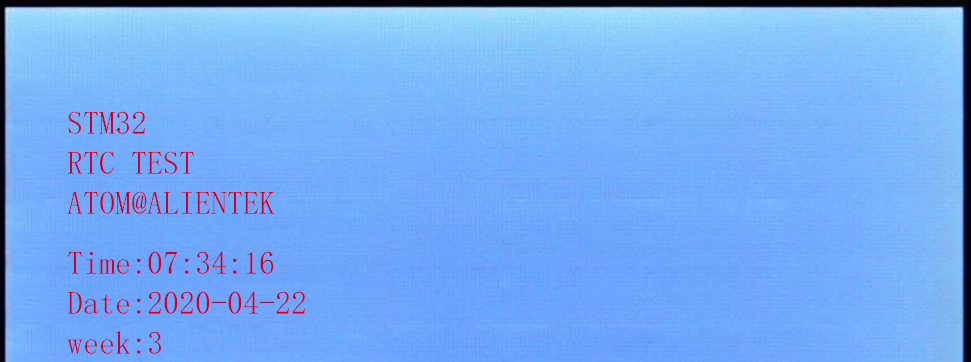
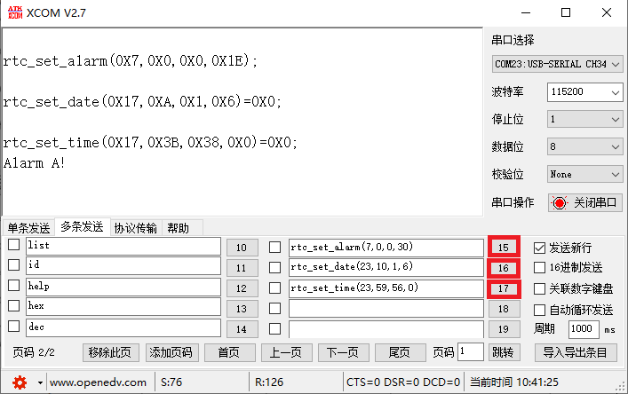

# RTC

RTC实时时钟实验

## 前言

本章，我们将介绍STM32N647的内部实时时钟（RTC）。我们将使用LCD模块来显示日期和时间，实现一个简单的实时时钟，并可以设置闹铃，另外还将介绍BKP的使用。

本实验通过LCD显示RTC时间，并可以通过usmart设置RTC时间，从而调节时间，或设置RTC闹钟，还可以写入或者读取RTC后备区域SRAM。LED1每两秒闪烁一次，表示进入WAKE UP中断。LED0闪烁，提示程序运行。

## 实验准备

1. 编写成功后，切换BOOT1跳线帽至3.3V处，便可进行程序下载，下载完之后，将BOOT1跳线帽切换回GND处，对开发板重新上电。

## 实验现象

将程序下载到开发板后，可以看到LED0不停的闪烁，提示程序已经在运行了，同时LED1每两秒闪烁一次，说明周期性唤醒中断工作正常。然后，可以看到LCD模块开始显示时间，如下图所示：

如果时间和日期不正确，可以利用上一章介绍的usmart工具，通过串口来设置，并且可以设置闹钟时间等，如下图所示：

按照图中编号15、16、17顺序，设置闹钟A、设置日期、设置时间。然后等待我们设置的时间到来后，串口打印ALARM A!这个字符串，证明我们的闹钟A程序正常运行了！
