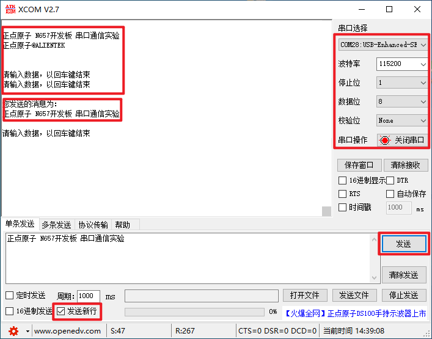

# Serial

串口通信实验

## 前言

本章我们将学习STM32N647的串口，教大家如何使用STM32N647的串口来发送和接收数据。本章将实现如下功能：STM32N647通过串口和上位机的对话，STM32N647在收到上位机发过来的字符串后，原原本本的返回给上位机。

本实验，LED0闪烁，提示程序在运行。 STM32通过串口1和上位机对话，STM32在收到上位机发过来的字符串（以回车换行结束）后，会返回给上位机。同时每隔一定时间，通过串口1输出一段信息到电脑。

## 实验准备

1. 编写成功后，切换BOOT1跳线帽至3.3V处，便可进行程序下载，下载完之后，将BOOT1跳线帽切换回GND处，对开发板重新上电。

## 实验现象

下载完成之后，可以看到板子上的LED0开始闪烁，说明程序已经在跑了。串口调试助手，我们用XCOM V2.7，该软件在光盘有提供，且无需安装，直接可以运行，但是需要你的电脑安装有.NET Framework 4.0(WIN自带了)或以上版本的环境才可以，该软件的详细介绍请看：http://www.openedv.com/posts/list/22994.htm 这个帖子。

接着我们打开XCOM V2.7，设置串口为开发板的USB转串口（CH340虚拟串口，得根据你自己的电脑选择，我的电脑是COM28，另外，请注意：波特率是115200）。因为我们在程序上面设置了必须输入回车，串口才认可接收到的数据，所以必须在发送数据后再发送一个回车符，这里XCOM提供的发送方法是通过勾选发送新行实现，只要勾选了这个选项，每次发送数据后，XCOM都会自动多发一个回车(0X0D+0X0A)。设置好了发送新行，我们再在发送区输入你想要发送的文字，然后单击发送，可以看到如图所示：

可以看到，我们发送的消息被发送回来了。大家可以试试，如果不发送回车（取消发送新行），在输入内容之后，直接按发送是什么结果，大家测试一下吧。
