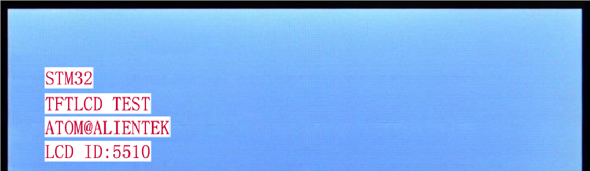

# TFTLCD

TFTLCD(MCU屏)实验

## 前言

前面我们介绍了OLED模块及其显示，但是该模块只能显示单色/双色，不能显示彩色，而且尺寸也较小。本章我们将介绍正点原子的TFT LCD模块（MCU屏），该模块采用TFTLCD面板，可以显示16位色的真彩图片。在本章中，我们将使用开发板底板上的TFTLCD接口（仅支持MCU屏，本章仅介绍MCU屏的使用），来点亮TFTLCD，并实现ASCII字符和彩色的显示等功能，并在串口打印LCD控制器ID，同时在LCD上面显示。

使用开发板的MCU屏接口连接正点原子 TFTLCD模块(仅限MCU屏模块)，实现TFTLCD模块的显示。通过把LCD模块插入底板上的TFTLCD模块接口，按下复位之后，就可以看到LCD模块不停的显示一些信息并不断切换底色。同时该实验会显示LCD驱动器的ID。LED0闪烁用于提示程序正在运行。

本实验对应的工程文件夹为：`<STM32N647 开发板软件包路径>/Projects/14_TFTLCD`。

## 实验准备

1. 将 STM32N647 开发板软件包中提供的示例 FSBL 固件烧录到 STM32N647 开发板上。

:::tip[FSBL 烧录说明]

本实验使用的 FSBL 为 STM32N647 开发板软件包中的示例 FSBL，请根据 [**示例 FSBL介绍**](../start-guide/software-package/software-package.md#fsbl) 中的说明烧录对应 `fsbl.hex`。

不同的的实验中，若使用相同的 FSBL，则无需重复烧录。

:::

2. 将工程文件夹下 `Binary` 目录下的 `appli.hex` 依次烧录到 STM32N647 开发板上。

:::tip[烧录说明]

烧录顺序不影响烧录结果。

[**使用 `STM32CubeProgrammer` 烧录**](../start-guide/start-development/step-by-step.md#step-3-使用-stm32cubeprogrammer-烧录)。

:::

3. 将 LCD 接入 STM32N647 开发板的 `TFTLCD` 接口。

:::info[LCD 适配说明]

本实验例程仅支持 `正点原子 MCU 触摸屏模块`。

:::

4. 将 STM32N647 开发板的 BOOT 模式配置为 `Flash boot` 模式

:::tip[STM32N647 开发板 BOOT 模式配置说明]

通过 STM32N647 开发板 `P6` 的跳线帽配置其 BOOT 模式：

`Development boot`：B1 接 3V3

`Flash boot`：B0、B1 都接 GND

:::

5. 将对应接口的电源线接入 STM32N647 开发板底板的 USB Type-C 接口或 DC 接口，为其进行供电，并将 `K1` 自锁开关切换到开启状态。

## 实验现象

下载代码后，LED0不停的闪烁，提示程序已经在运行了。同时可以看到TFTLCD模块的显示背景色不停切换，如图所示： 

