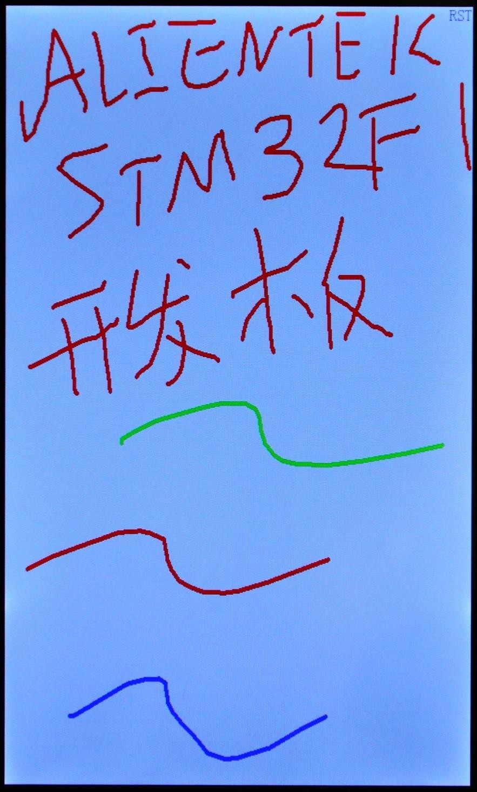

# Touch

触摸屏实验

## 前言

本章，我们将介绍如何使用STM32N647来驱动触摸屏，STM32N647本身并没有触摸屏控制器，但是它支持触摸屏，可以通过外接带触摸屏的LCD模块（比如正点原子RGBLCD模块），来实现触摸屏控制。在本章中，我们将向大家介绍STM32控制正点原子RGBLCD模块，实现触摸屏驱动，最终实现一个手写板的功能。

正点原子N647的实验例程，默认支持RGBLCD显示器（包括4.3寸、7寸和10.1寸共计5款），这五款RGBLCD显示器均采用电容触摸的方式，在初始化电容触摸屏完成后，进入电容触摸屏测试程序（电容触摸屏无需校准！！），测试界面的右上角会有一个清空的操作区域（RST），点击这个地方就会将输入全部清除，恢复白板状态。

## 实验准备

1. 编译成功后，切换BOOT1跳线帽至3.3V处，便可进行程序下载，下载完之后，将BOOT1跳线帽切换回GND处，对开发板重新上电。

## 实验现象

在代码编译成功之后，我们通过下载代码到开发板上，电容触摸屏测试如下图所示：

电容屏支持多点触摸，每个点的颜色都不一样，图中的波浪线就是三点触摸画出来的，最多可以5点触摸。按右上角的RST标志，可以清屏。

