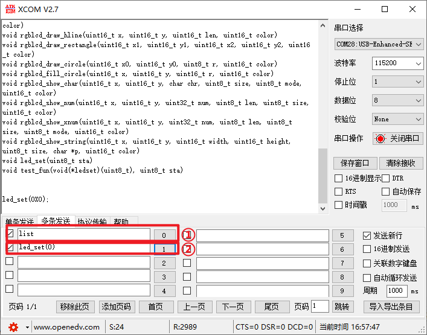

# USMART 调试组件实验

USMART

## 前言

本章，我们将向大家介绍一个十分重要的辅助调试工具：USMART调试组件。该组件由正点原子开发提供，功能类似linux的shell（RTT的finsh也属于此类）。USMART最主要的功能就是通过串口调用单片机里面的函数，并执行，对我们调试代码是很有帮助的。

本实验通过usmart调用单片机里面的函数，实现对LCD显示和LED以及延时的控制。LED0闪烁用于提示程序正在运行。

本实验对应的工程文件夹为：`<STM32N647 开发板软件包路径>/Projects/16_USMART`。

## 实验准备

1. 将 STM32N647 开发板软件包中提供的示例 FSBL 固件烧录到 STM32N647 开发板上。

:::tip[FSBL 烧录说明]

本实验使用的 FSBL 为 STM32N647 开发板软件包中的示例 FSBL，请根据 [**示例 FSBL介绍**](../start-guide/software-package/software-package.md#fsbl) 中的说明烧录对应 `fsbl.hex`。

不同的的实验中，若使用相同的 FSBL，则无需重复烧录。

:::

2. 将工程文件夹下 `Binary` 目录下的 `appli.hex` 依次烧录到 STM32N647 开发板上。

:::tip[烧录说明]

烧录顺序不影响烧录结果。

[**使用 `STM32CubeProgrammer` 烧录**](../start-guide/start-development/step-by-step.md#step-3-使用-stm32cubeprogrammer-烧录)。

:::

3. 将 LCD 通过 FPC 延长线接入 STM32N647 开发板核心板的 `RGBLCD` 接口。

:::info[LCD 适配说明]

本实验例程仅支持 `正点原子 RGB 触摸屏模块`。

:::

4. 使用 USB Type-C 数据线将串口调试助手的物理机与 STM32N647 开发板的 `USB UART` 接口连接。

5. 将 STM32N647 开发板的 BOOT 模式配置为 `Flash boot` 模式

:::tip[STM32N647 开发板 BOOT 模式配置说明]

通过 STM32N647 开发板 `P6` 的跳线帽配置其 BOOT 模式：

`Development boot`：B1 接 3V3

`Flash boot`：B0、B1 都接 GND

:::

6. 将对应接口的电源线接入 STM32N647 开发板底板的 USB Type-C 接口或 DC 接口，为其进行供电，并将 `K1` 自锁开关切换到开启状态。

## 实验现象

将程序下载到开发板后，可以看到LED0不停的闪烁，提示程序已经在运行了。同时，屏幕上显示了一些字符（就是主函数里面要显示的字符）。

我们打开串口调试助手XCOM，选择正确的串口号→多条发送→勾选发送新行（即发送回车键）选项，然后发送list指令，即可打印所有usmart可调用函数。

我们这里使用led_set(0)函数，将LED1点亮，如下图所示：

USMART调试工具还拥有以下常用指令：

- list，该命令用于打印所有usmart可调用函数。发送该命令后，串口将受到所有能被usmart调用得到函数，如图27.4.1所示。

- id，该指令用于获取各个函数的入口地址。比如前面写的test_fun函数，就有一个函数参数，我们需要先通过id指令，获取led_set函数的id（即入口地址），然后将这个id作为函数参数，传递给test_fun。

- help（或者‘?’也可以），发送该指令后，串口将打印usmart使用的帮助信息。

hex和dec，这两个指令可以带参数，也可以不带参数。当不带参数的时候，hex和dec分别用于设置串口显示数据格式为16进制/10进制。当带参数的时候，hex和dec就执行进制转换，比如输入：hex 1234，串口将打印：HEX:0X4D2，也就是将1234转换为16进制打印出来。又比如输入：dec 0X1234，串口将打印：DEC:4660，就是将0X1234转换为10进制打印出来。

- runtime指令，用于函数执行时间统计功能的开启和关闭，发送：runtime 1，可以开启函数执行时间统计功能；发送：runtime 0，可以关闭函数执行时间统计功能。函数执行时间统计功能，默认是关闭的。

大家可以亲自体验下这几个系统指令，不过要注意，所有的指令都是大小写敏感的，不要写错哦。