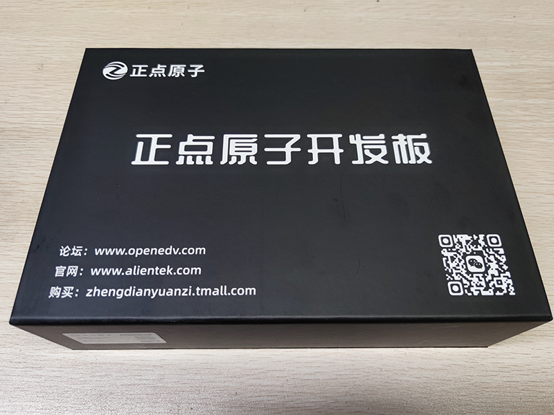
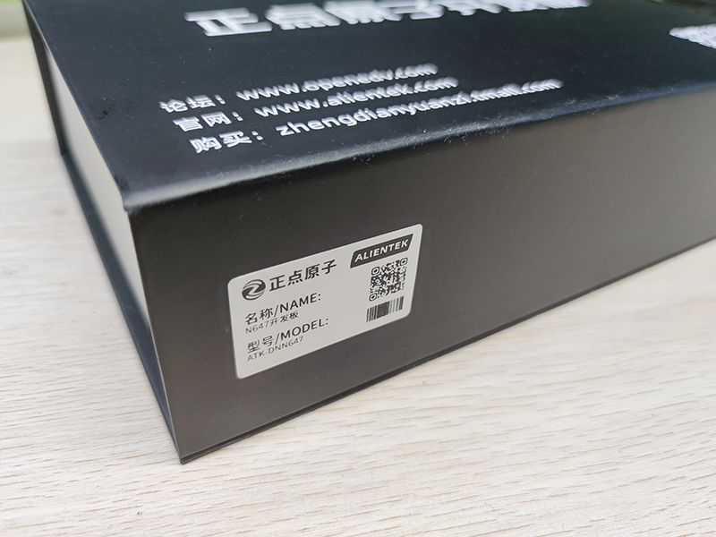
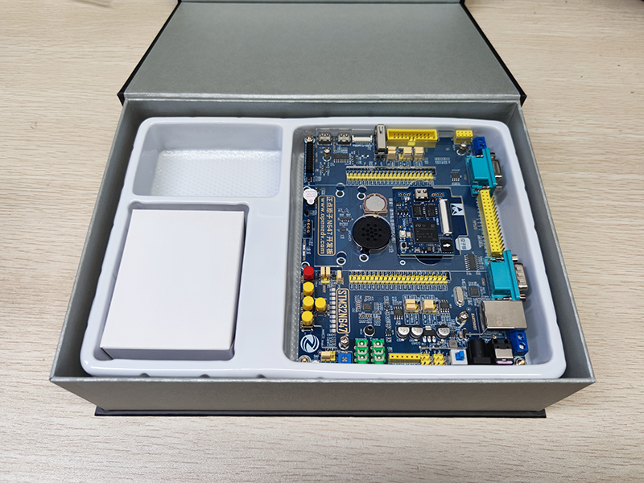
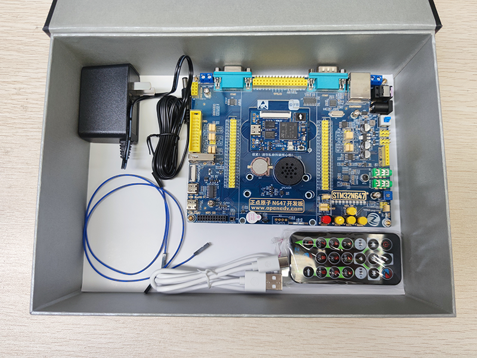

# 产品验收

在收到产品包裹后，请先根据自己的购买清单，核对收到的货物（通常情况下，产品包裹中会提供有发货单）。

## 外观检查

STM32N647 开发板 采用正点原子精美包装盒进行包装，如下

在精美包装盒前面有包装盒内板子的名称和型号信息，如下

精美包装盒内包含了 STM32N647 开发板 标准套餐中的所有物品，如还购买了其他产品，请单独验收。

在确认精美包装盒外观无损坏后，打开精美包装盒便可看到 STM32N647 开发板，如下

精美包装盒分为上下两层，上层为 STM32N6 开发板 和附带的一个 12V 输出的开关电源适配器，下层是红外遥控器、Type-C数据线和杜邦线。

精美包装盒内的所有物品，如下

1. 正点原子 STM32N647 开发板
2. 电源适配器
3. 红外遥控器
4. USB 线数据线（Type-A to Type-C）
5. 杜邦线 x2

请依次检查精美包装盒中物品的数量和外观是否无异。