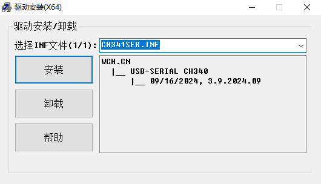
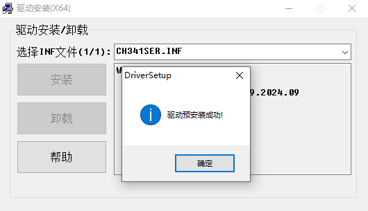

# CH340C 驱动安装

## 概述

[**CH340C**](https://www.wch.cn/products/CH340.html?) 是一个 USB 总线的转接芯片，实现 USB 转串口或者 USB 转打印口。

## 获取

可以通过 [**这里**](https://www.wch.cn/search.html?q=CH340&t=downloads) 获取 CH340C 驱动的安装包。

## 安装

打开 CH340C 驱动的安装程序

点击软件界面的“安装”按钮，并等待安装完成

至此，CH340C 驱动安装完毕。