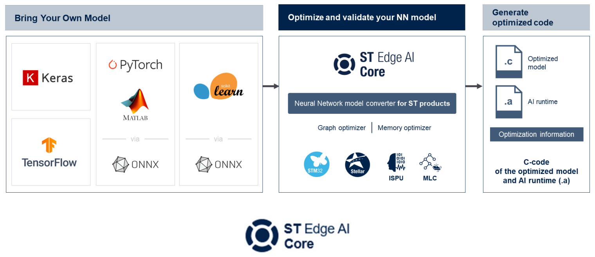
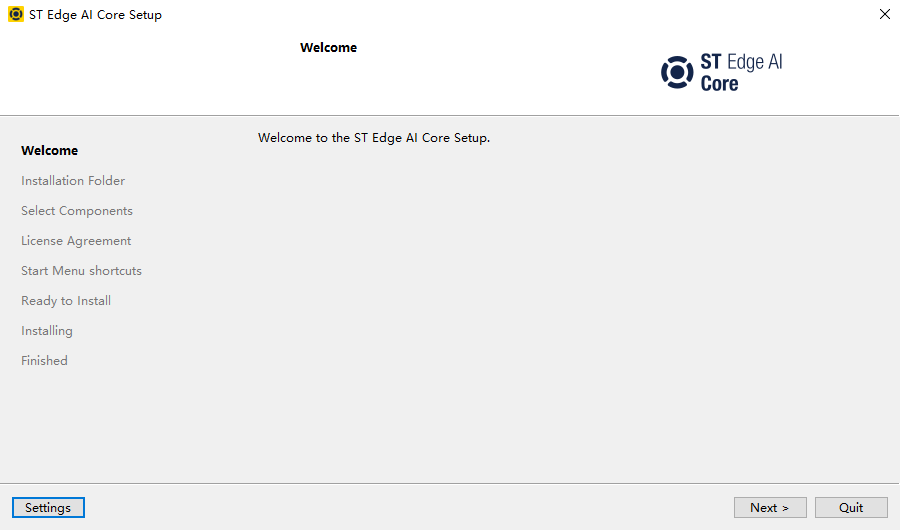
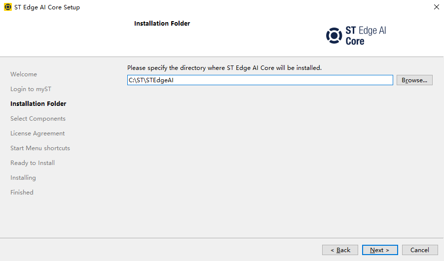
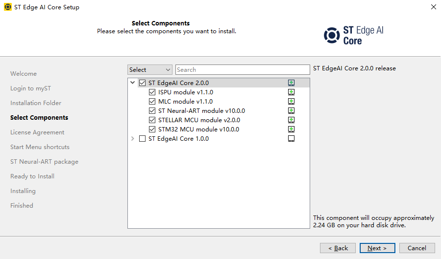
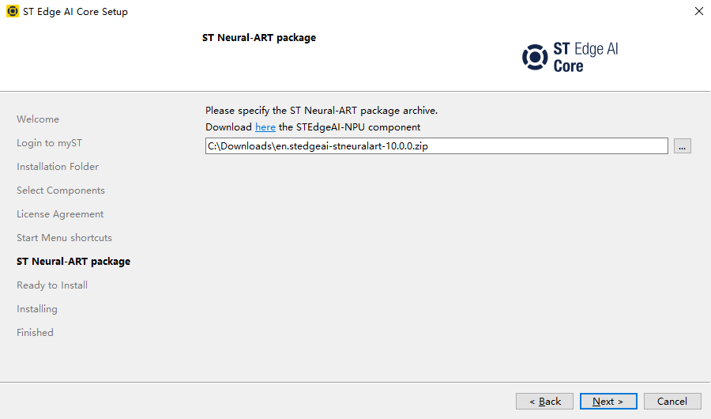

# STEdgeAI-Core 软件安装

## 概述

[**STEdgeAI-Core**](https://www.st.com/en/development-tools/stedgeai-core.html) 是一款免费的桌面工具，用于评估、优化和编译多个意法半导体产品的边缘 AI 模型，包括微控制器、微处理器、Neural-ART 加速器以及配备 ISPU 和 MLC 的智能传感器。



## 获取

可以通过 [**这里**](https://www.st.com/en/development-tools/stedgeai-core.html#get-software) 获取 STEdgeAI-Core 的安装包。

可以通过 [**这里**](https://www.st.com/en/development-tools/stedgeai-core.html#get-software) 获取 ST Neural-ART 的软件包。

## 安装

打开 STEdgeAI-Core 的安装程序，程序会启动 STEdgeAI-Core 的安装向导



根据安装向导的提示，选择安装路径



根据安装向导的提示，选择需要安装的组件



根据安装向导的提示，选择 ST Neural-ART 软件包的路径



至此，STEdgeAI-Core 安装完毕。

## 配置（可选）

STEdgeAI-Core 安装完毕后，建议将其可执行文件所在的路径添加到系统的环境变量中，以便在命令行中直接调用 STEdgeAI-Core。

STEdgeAI-Core 的可执行文件所在的路径为：`<STEdgeAI-Core 安装路径>/2.0/Utilities/windows`

可通过以下命令验证环境变量是否配置成功：

```shell
stedgeai --version
```

如果环境变量配置成功，则该命令会输出 STEdgeAI-Core 的版本信息，例如：

```shell
ST Edge AI Core v2.0.0-20049
   ISPU 1.1.0
   MLC 1.1.0
   StellarStudioAI 2.0.0
   STM32CubeAI 10.0.0
```