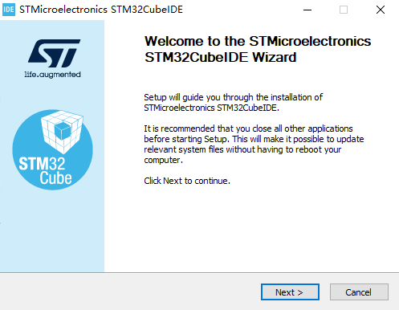

# STM32CubeIDE 软件安装

## 概述

[**STM32CubeIDE**](https://www.st.com.cn/zh/development-tools/stm32cubeide.html) 是一种高级 C/C++ 开发平台，具有 STM32 微控制器和微处理器的外设配置、代码生成、代码编译和调试功能。

## 获取

可以通过 [**这里**](https://www.st.com/en/development-tools/stm32cubeide.html#get-software) 获取 STM32CubeIDE 的安装包。

## 安装

打开 STM32CubeIDE 的安装程序，程序会启动 STM32CubeIDE 的安装向导

根据安装向导的提示，选择安装路径

根据安装向导的提示，选择需要安装的仿真器驱动

至此，STM32CubeIDE 安装完毕。