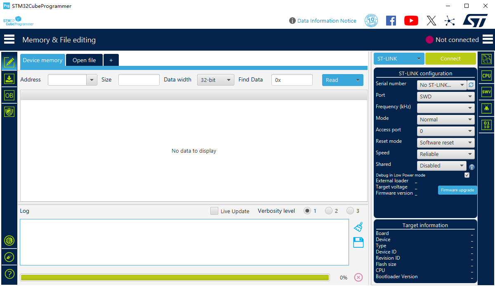
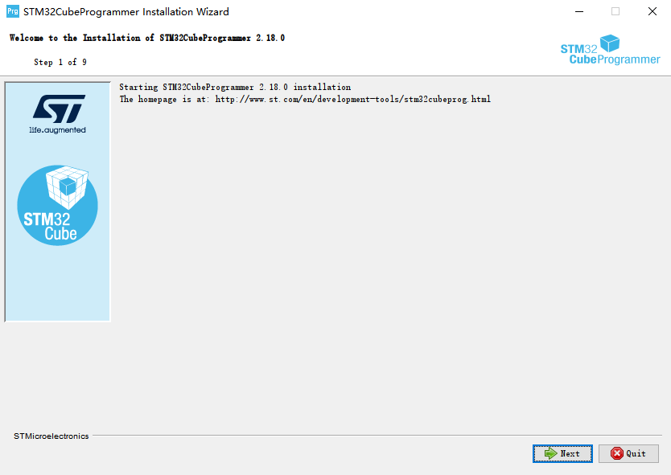
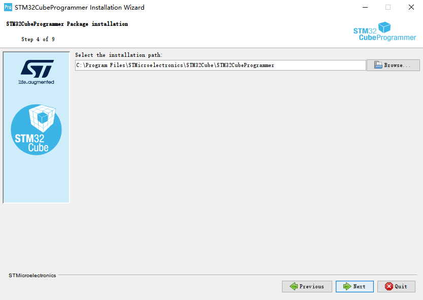
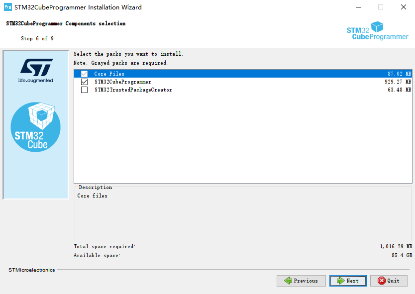
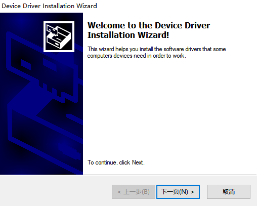

# STM32CubeProgrammer 软件安装

## 概述

[**STM32CubeProgrammer**](https://www.st.com/en/development-tools/stm32cubeprog.html)(STM32CubeProg) 是一款用于编程STM32产品的全功能多操作系统软件工具。

## 获取

可以通过 [**这里**](https://www.st.com/en/development-tools/stm32cubeprog.html#get-software) 获取 STM32CubeProgrammer 的安装包。

## 安装

打开 STM32CubeProgrammer 的安装程序，程序会启动 STM32CubeProgrammer 的安装向导

根据安装向导的提示，选择安装路径

根据安装向导的提示，选择需要安装的包

在安装过程中，安装向导会启动驱动程序的安装向导，该驱动的安装向导主要用于安装ST-Link等的驱动，根据提示进行安装即可

至此，STM32CubeProgrammer 安装完毕。