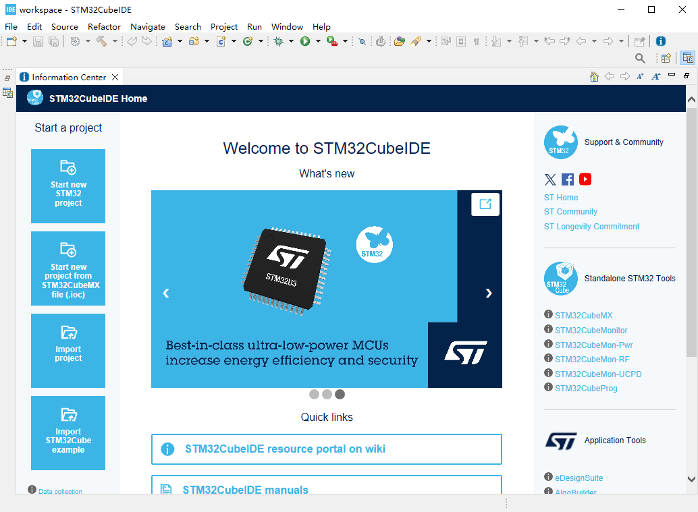
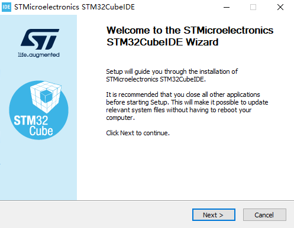
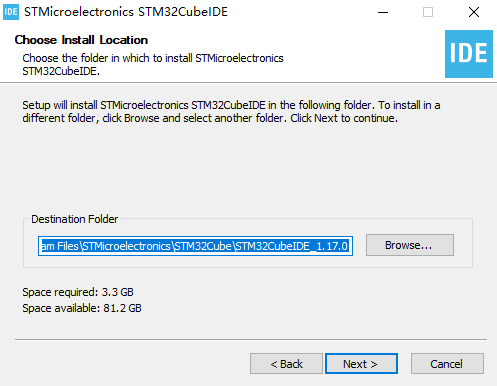
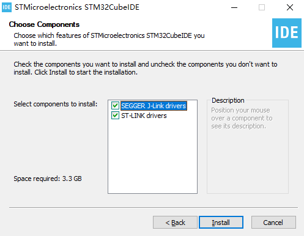

# STM32CubeIDE 软件安装

## 概述

[**STM32CubeIDE**](https://www.st.com.cn/zh/development-tools/stm32cubeide.html) 是一种高级 C/C++ 开发平台，具有 STM32 微控制器和微处理器的外设配置、代码生成、代码编译和调试功能。



## 获取

可以通过 [**这里**](https://www.st.com/en/development-tools/stm32cubeide.html#get-software) 获取 STM32CubeIDE 的安装包。

## 安装

打开 STM32CubeIDE 的安装程序，程序会启动 STM32CubeIDE 的安装向导



根据安装向导的提示，选择安装路径



根据安装向导的提示，选择需要安装的仿真器驱动



至此，STM32CubeIDE 安装完毕。

## 配置

STM32CubeIDE 安装完毕后，建议配置 STM32CubeIDE GUN Tools for STM32 插件的可执行文件路径到系统的环境变量，以便在命令行中直接调用 GUN Tools for STM32。

STM32CubeIDE GUN Tools for STM32 插件的可执行文件所在的路径为：`<STM32CubeIDE 安装路径>/plugins/com.st.stm32cube.ide.mcu.externaltools.gnu-tools-for-stm32.xxx\tools\bin`

可通过以下命令验证环境变量是否配置成功：

```shell
arm-none-eabi-gcc --version
```

如果环境变量配置成功，则该命令会输出 GUN Tools for STM32 的版本信息，例如：

```shell
arm-none-eabi-gcc.exe (GNU Tools for STM32 12.3.rel1.20240926-1715) 12.3.1 20230626
Copyright (C) 2022 Free Software Foundation, Inc.
This is free software; see the source for copying conditions.  There is NO
warranty; not even for MERCHANTABILITY or FITNESS FOR A PARTICULAR PURPOSE.
```