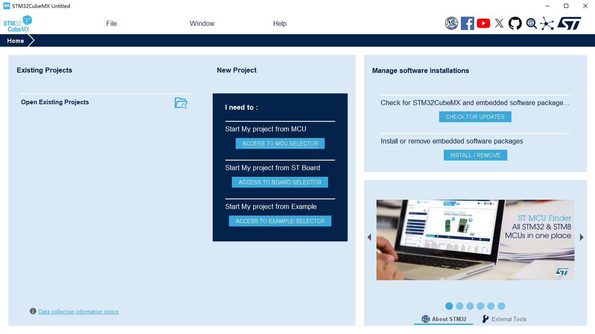
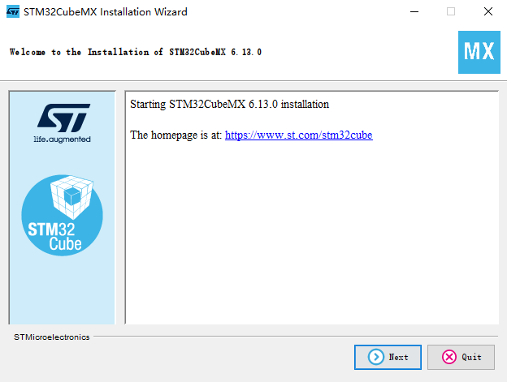
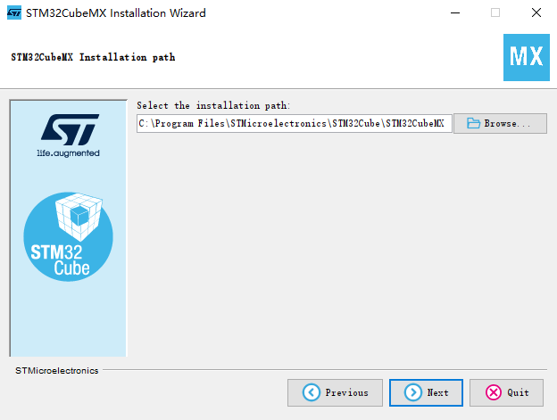

# STM32CubeMX 软件安装

## 概述

[**STM32CubeMX**](https://www.st.com/en/development-tools/stm32cubemx.html) 是一种图形工具，通过分步过程可以非常轻松地配置 STM32 微控制器和微处理器，以及为 Arm® Cortex®-M 内核或面向 Arm® Cortex®-A 内核的特定 Linux® 设备树生成相应的初始化 C 代码。

## 获取

可以通过 [**这里**](https://www.st.com/en/development-tools/stm32cubemx.html#get-software) 获取 STM32CubeMX 的安装包。

## 安装

打开 STM32CubeMX 的安装程序，程序会启动 STM32CubeMX 的安装向导

根据安装向导的提示，选择安装路径

至此，STM32CubeMX 安装完毕。