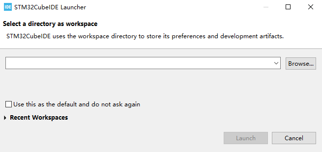
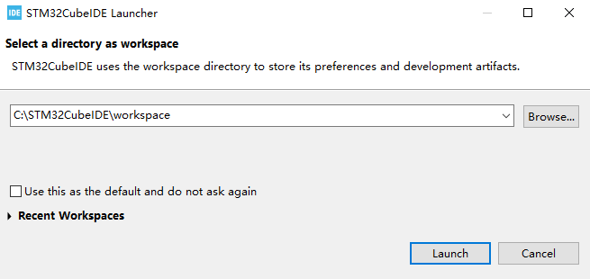
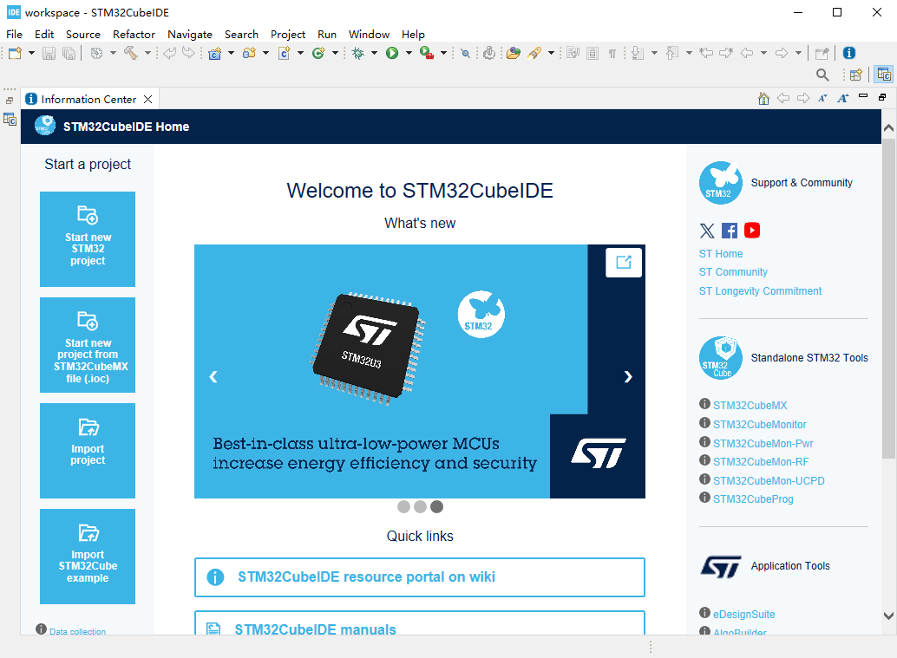

# STM32CubeIDE

在开发过程中，STM32CubeIDE 提供了一整套集成开发环境，包括代码编辑、编译、在线调试和烧录等诸多功能。

## 创建 Workspace

Workspace 是 STM32CubeIDE 中的一个重要概念，用于管理一个或多个项目工程。

在文件系统中新建一个即将被作为 Workspace 的文件夹，然后打开 STM32CubeIDE，软件会提示选择一个目录作为 Wirkspace



点击 `Browse...` 选择刚刚新建的空文件夹，完后点击 `Launch`



即可将刚刚新建的文件夹作为 Workspace 来启动 STM32CubeIDE



:::tip[Workspace 说明]

选定 Workspace 打开 STM32CubeIDE 后，在 STM32CubeIDE 软件中的所有配置操作都仅会影响当前 Workspace，不会影响其他 Workspace。

:::

## 添加 External loader 文件

STM32CubeIDE 可以将编译好的固件烧录到 STM32N6 外部的 Flash中，不过需要借助 External loader 文件来实现。

:::tip[STM32N647 开发板的 External loader 文件]

STM32N647 开发板的软件包中提供了适用于 STM32N647 开发板的 External loader 文件。

:::

External loader 文件需拷贝到特定的路径下，才能被 STM32CubeIDE 正确调用，具体路径为 `<STM32CubeIDE 安装路径>/plugins/com.st.stm32cube.ide.mcu.externaltools.cubeprogrammer.xxx/tools/bin/ExternalLoader`。

将 External loader 文件拷贝到上述路径以后，STM32CubeIDE 就可以正常调用 External loader 文件了。

## 系统环境变量配置

在开发前，需要配置 STM32CubeIDE GUN Tools for STM32 插件的可执行文件路径到系统的环境变量，以便在命令行中直接调用 GUN Tools for STM32。

STM32CubeIDE GUN Tools for STM32 插件的可执行文件所在的路径为：`<STM32CubeIDE 安装路径>/plugins/com.st.stm32cube.ide.mcu.externaltools.gnu-tools-for-stm32.xxx\tools\bin`

可通过以下命令验证环境变量是否配置成功：

```shell
arm-none-eabi-gcc --version
```

如果环境变量配置成功，则该命令会输出 GUN Tools for STM32 的版本信息，例如：

```shell
arm-none-eabi-gcc.exe (GNU Tools for STM32 12.3.rel1.20240926-1715) 12.3.1 20230626
Copyright (C) 2022 Free Software Foundation, Inc.
This is free software; see the source for copying conditions.  There is NO
warranty; not even for MERCHANTABILITY or FITNESS FOR A PARTICULAR PURPOSE.
```