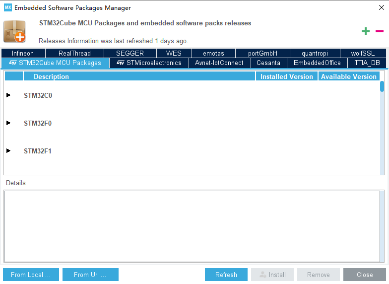
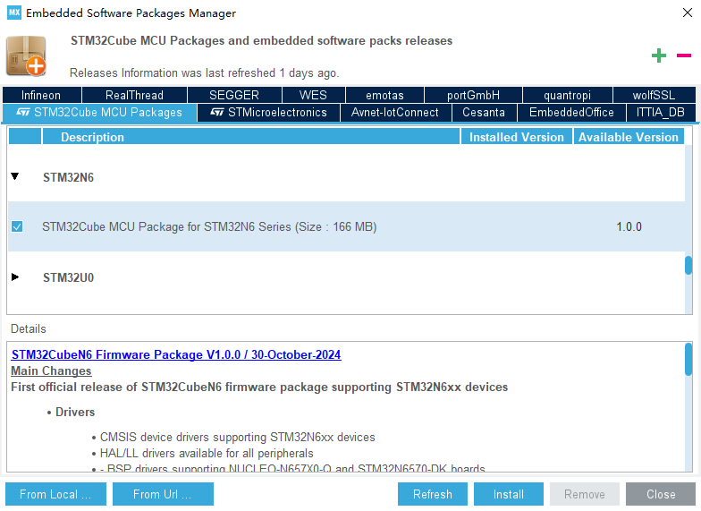
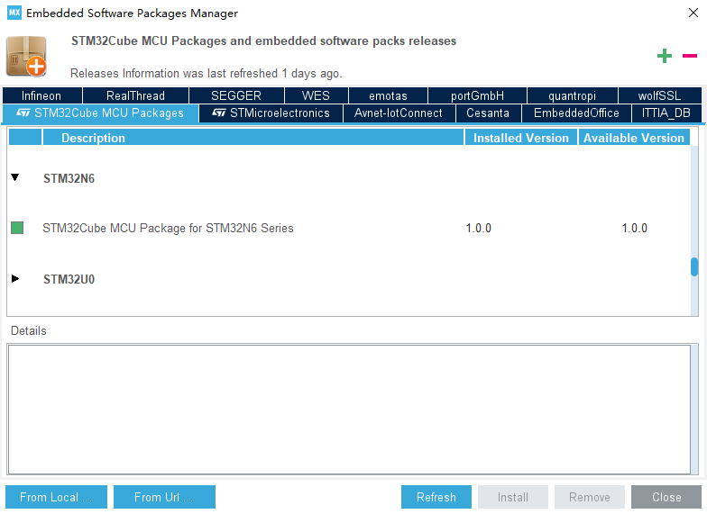

# STM32CubeMX

在开发过程中，STM32CubeMX 为开发者提供图形化的配置界面，并帮助开发者快速生成初始化代码，从而简化开发过程、提高开发效率。

## STM32Cube MCU 软件包下载

:::info[STM32CubeMX 中的 STM32Cube MCU 软件包说明]

在使用 STM32CubeMX 配置工程时，默认使用 `软件包管理器` 指定的 STM32Cube MCU 软件包，同时，也可以手动指定 STM32Cube MCU 软件包的路径。

:::

在使用 STM32CubeMX 开发 STM32N6 之前，需要先在 STM32CubeMX 的内嵌软件包管理器中下载针对 STM32N6 的 STM32Cube MCU 软件包。

打开 STM32CubeMX 后，依次点击工具栏中的 "Help" -> "Manage embedded software packages" 或通过快捷键 `Alt + U` 打开软件包管理器

在 `STM32Cube MCU Packages` 栏中找到 `STM32N6`，并勾选

点击 `Install` 按钮开始下载 STM32N6 的 STM32Cube MCU 软件包，并等待下载完成即可

