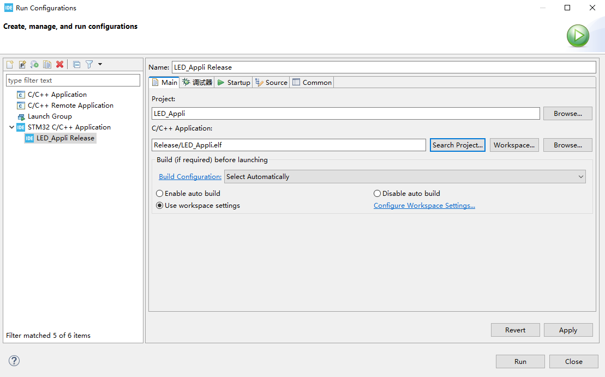

import Tabs from '@theme/Tabs';
import TabItem from '@theme/TabItem';

# 开发流程 Step-by-Step

本文将以实现 STM32N647 开发板板载的两个 LED 交替闪烁的功能为例，介绍使用 STM32CubeMX、STM32CubeIDE 和 STM32CubeProgrammer 完成 STM32N647 开发板基础应用开发的流程

## Step 1. 使用 STM32CubeMX 生成初始化工程

### Step 1.1. 选择 MCU 型号

打开 STM32CubeMX 后，依次点击工具栏中的 "File" -> "New Project ..." 或通过快捷键 `Ctrl + N` 来新建一个 STM32CubeMX 工程，软件会打开一个选择 MCU 型号的界面


在界面左侧添加 `STM32N647X0H3Q` 的信息，然后在界面右侧找到并选中 `STM32N647X0H3Q`，然后点击右上角的 `Start Project`


因为 STM32N6 系列 MCU 具有 TrustZone 功能，因此需要配置如何新建工程

:::note

本文介绍的基础开发流程不涉及 TrustZone 功能，因此选择新建的工程为 `Secrue domain only`

:::


### Step 1.2. 配置工程信息

进入配置界面后，打开 `Project Manager` 配置工程的基础信息

:::::info[Project Manager 重要配置项说明]

<Tabs>
    <TabItem value="project" label="Project">
        <Tabs>
            <TabItem value="project-settings" label="Project Settings">

                `Project Structure`：选择需要的工程结构，这里仅勾选 Appli

                ::::tip[Project Structure介绍]

                `FSBL`：FSBL（First Stage Boot Loader）工程主要用于开发 FSBL，FSBL 是 STM32N6 结束硬件复位后自动从外部 Flash 加载到内部 SRAM 并运行的第一段用户程序，主要完成相应的初始化工作，并启动 Appli 程序

                :::warning[FSBL 注意事项]

                FSBL 固件需要使用 STM32_SigningTool_CLI 工具添加头部签名后，烧录到 STM32N6 外部 Flash 的 0 偏移地址处，才能由 STM32N6 正常启动

                使用 STM32_SigningTool_CLI 工具为 FSBL 固件添加头部签名的命令如下：

                ```shell

                $STM32_PRG_PATH/STM32_SigningTool_CLI -bin fsbl.bin -nk -of 0x80000000 -t fsbl -o fsbl-trusted.bin -hv 2.3 -dump fsbl-trusted.bin

                ```

                :::

                `Appli`：Appli 工程主要用于开发用户的应用程序，应用程序主要用于实现用户功能

                :::warning[Appli 注意事项]

                Appli 固件需要由 FSBL 启动，因此 Appli 固件需要根据 FSBL 指定的 STM32N6 外部 Flash 偏移地址进行开发和烧录，才能被 FSBL 正常启动

                :::

                `ExtMemLoader`：Appli 工程主要用于开发 External loader，External loader 主要用于 STM32CubeProgrammer、STM32CubeIDE 等工具访问、操作 MCU 外部 Flash

                :::warning[ExtMemLoader 注意事项]

                External loader 需拷贝到特定的路径下，才能被 STM32CubeProgrammer、STM32CubeIDE 等工具正确调用，具体路径如下：

                - STM32CubeProgrammer：`<STM32CubeProgrammer 安装路径>/bin/ExternalLoader`

                - STM32CubeIDE：`<STM32CubeIDE 安装路径>/plugins/com.st.stm32cube.ide.mcu.externaltools.cubeprogrammer.xxx/tools/bin/ExternalLoader`

                :::

                ::::

                `Toolchain / IDE`：选择所使用的工具链或 IDE，这里选择 STM32CubeIDE，并取消勾选Generate Under Root，因为后续需要使用 STM32CubeIDE 打开工程

            </TabItem>
            <TabItem value="mcu-and-firmware-package" label="Mcu and Firmware Package">

                `Use Default Firmware Location`：选择是否使用默认的 STM32Cube MCU 软件包路径，可根据实际需求选择

                `Firmware Relative Path`：选择自定义 STM32Cube MCU 软件包的路径

            </TabItem>
        </Tabs>
    </TabItem>
    <TabItem value="code-generator" label="Code Generator">
        <Tabs>
            <TabItem value="stm32cube-mcu-packages-and-embedded-software-packs" label="STM32Cube MCU packages and embedded software packs">

            选择工程使用 STM32Cube MCU 软件包等库文件的方式，可根据实际需求选择

            </TabItem>
        </Tabs>
    </TabItem>
</Tabs>

:::::


### Step 1.3. MCU 引脚和外设配置

接下来，打开 `Pinout & Configuration` 配置 MCU 引脚和外设

#### Step 1.3.1. CPU Cache 配置

在 `CORTEX_M55_S` 配置页中，将 `CPU ICache` 和 `CPU DCache` 都配置为 `Enable`


#### Step 1.3.2. GPIO 配置

:::info

STM32N647 开发板板载的两个 LED 分别由 `PG10` 和 `PE10` 控制

:::

先在 `Pinout view` 中，将 `PG10` 和 `PE10` 配置为 `GPIO_Output`，然后在 `GPIO` 配置页中，配置 `PG10` 和 `PE10`


#### Step 1.3.3. 电源配置

:::info

STM32N647 开发板使用 STM32N6 内部的 SMPS 为 V<sub>DDCORE</sub> 供电

:::

在 `RCC` 配置页中，将 `SupplySource` 配置为 `PWR_SMPS_SUPPLY`


#### Step 1.3.4. HAL 库时基源配置

在 `SYS_S` 配置页中，将 `Timebase Source` 配置为 `SysTick`

:::note[SYS_S 的 Runtime contexts 配置]

仅勾选 `Application`

:::


### Step 1.4. 时钟配置

:::note[时钟配置说明]

时钟需根据实际需求进行配置，本文仅给出一个简单的时钟配置示例

:::

接下来，打开 `Clock Configuration` 对 MCU 的时钟进行配置

#### Step 1.4.1. PLL1 配置


#### Step 1.4.2. IC1、IC2、IC6 和 IC11 配置


#### Step 1.4.2. CPU Clock 和 System Clock 配置


### Step 1.5. 生成代码

完成上述配置后，点击软件界面右上方的 `GENERATE CODE`，生成初始化工程

等待软件弹出以下信息框，表示生成完毕


接下来可通过直接信息框的 `Open Project` 或通过工程目录下的 `STM32CubeIDE/.project` 打开 STM32CubeIDE，进行下一步的开发

## Step 2. 使用 STM32CubeIDE 开发

### Step 2.1. 编写应用代码

在 `STM32CubeIDE` 中，打开 `main.c` 文件并编辑 `main` 函数：

```c
int main(void)
{

  /* USER CODE BEGIN 1 */

  /* USER CODE END 1 */

  /* Enable the CPU Cache */

  /* Enable I-Cache---------------------------------------------------------*/
  SCB_EnableICache();

  /* Enable D-Cache---------------------------------------------------------*/
  SCB_EnableDCache();

  /* MCU Configuration--------------------------------------------------------*/

  /* Update SystemCoreClock variable according to RCC registers values. */
  SystemCoreClockUpdate();
  HAL_Init();

  /* USER CODE BEGIN Init */

  /* USER CODE END Init */

  /* Update SystemCoreClock variable */
  SystemCoreClockUpdate();

  /* USER CODE BEGIN SysInit */

  /* USER CODE END SysInit */

  /* Initialize all configured peripherals */
  SystemIsolation_Config();
  MX_GPIO_Init();
  /* USER CODE BEGIN 2 */

  /* USER CODE END 2 */

  /* Infinite loop */
  /* USER CODE BEGIN WHILE */
  while (1)
  {
    HAL_GPIO_TogglePin(GPIOG, GPIO_PIN_10);
    HAL_Delay(200);
    HAL_GPIO_TogglePin(GPIOE, GPIO_PIN_10);
    HAL_Delay(200);
    /* USER CODE END WHILE */

    /* USER CODE BEGIN 3 */
  }
  /* USER CODE END 3 */
}
```

:::info[应用代码介绍]

上述代码中，实现了跑马灯效果的功能

:::

:::danger[代码编辑注意事项]

对于 STM32CubeMX 生成的代码，强烈建议仅在 `xxx CODE BEGIN xxx` 和 `xxx CODE END xxx` 之间添加或修改代码，否则在后续使用 STM32CubeMX 重新生成代码时，添加或修改的代码会被覆盖

:::

### Step 2.2. 配置链接脚本

STM32CubeMX 生成的初始化工程中，将自带多个链接脚本

```shell
STM32CubeIDE/Appli/
|-- STM32N647X0HXQ_LRUN.ld
|-- STM32N647X0HXQ_LRUN_RAMxspi1.ld
|-- STM32N647X0HXQ_LRUN_RAMxspi2.ld
|-- STM32N647X0HXQ_ROMxspi1.ld
|-- STM32N647X0HXQ_ROMxspi1_RAMxspi2.ld
|-- STM32N647X0HXQ_ROMxspi1xspi2_RAMxspi3.ld
|-- STM32N647X0HXQ_ROMxspi2.ld
|-- STM32N647X0HXQ_ROMxspi2_RAMxspi1.ld
`-- STM32N647X0HXQ_ROMxspi3_RAMxspi1xspi2.ld
```

:::tip[STM32CubeMX 生成的链接脚本文件名字段说明]

`LRUN`：即 Load and Run，该类链接脚本中定义程序的加载地址和运行地址都在 STM32N6 内部的 SRAM 中，主要用于调试使用

`RAMxspi[1-3]`：该类链接脚本中定义程序使用了外部 RMA，并且外部 RAM 挂在 STM32N6 的 XSPIn上

`ROMxspi[1-3]`：该类脚本中定义程序的加载地址和运行地址都在 STM32N6 外部的 Flash 中，并且外部 Flash 挂在 STM32N6 的 XSPIn 上

:::

:::info

STM32N647 开发板板载了 HyperRAM 和 NORFlash，其中，通过 XSPI1 接口连接了容量为 32MB 的 HyperRAM，通过 XSPI2 接口连接了容量为 32MB 的 NORFlash

:::

本文将介绍使用 `STM32N647X0HXQ_LRUN_RAMxspi1.ld` 构建用于调试的工程，使用 `STM32N647X0HXQ_ROMxspi2_RAMxspi1.ld` 构建用于烧录的工程，但还需要修改这两个链接脚本，使其适用于 STM32N647 开发板

#### Step 2.2.1. 修改 `STM32N647X0HXQ_LRUN_RAMxspi1.ld`

打开 `STM32N647X0HXQ_LRUN_RAMxspi1.ld` 文件，找到 `MEMORY`，并将其修改为如下：

```ld
MEMORY
{
  RAM    (xrw)    : ORIGIN = 0x34000400,   LENGTH = 2047K
  EXTRAM (rw)     : ORIGIN = 0x90000000,   LENGTH = 32M
}
```

:::info

`ORIGIN`：为 Memory 的起始地址

`LENGTH`：为 Memory 的大小

:::

接下来，为该链接脚本添加一个给 `EXTRAM` 分配的 Section，找到 `SECTIONS`，并在其中添加一个 Section：

```ld
  /* External RAM */
  .EXTRAM (NOLOAD):
  {
    . = ALIGN(8);
    *(.EXTRAM)
    . = ALIGN(8);
  } >EXTRAM
```

#### Step 2.2.2. 修改 `STM32N647X0HXQ_ROMxspi2_RAMxspi1.ld`

打开 `STM32N647X0HXQ_ROMxspi2_RAMxspi1.ld` 文件，找到 `MEMORY`，并将其修改为如下：

```ld
MEMORY
{
  ROM    (xrw)    : ORIGIN = 0x70100400,   LENGTH = 31743K
  RAM    (xrw)    : ORIGIN = 0x34000000,   LENGTH = 2048K
  EXTRAM (rw)     : ORIGIN = 0x90000000,   LENGTH = 32M  
}
```

接下来，为该链接脚本添加一个给 `EXTRAM` 分配的 Section，找到 `SECTIONS`，并在其中添加一个 Section：

```ld
  /* External RAM */
  .EXTRAM (NOLOAD):
  {
    . = ALIGN(8);
    *(.EXTRAM)
    . = ALIGN(8);
  } >EXTRAM
```

#### Step 2.2.3. 配置工程使用的链接脚本

选中工程后，依次点击工具栏中的 "Project" -> "Properties" 或通过快捷键 `Alt + Enter` 打开工程的配置窗口


接着，依次打开 "C/C++ Build" -> "Settings" -> "Tool Settings" -> "MCU/MPU GCC Linker" -> "General"


:::tip[工程配置说明]

`Configuration` 用于切换当前窗口中的配置应用于工程的哪个配置，其中，`Debug` 对应用于调试的工程配置，`Release` 对应用于烧录的工程配置

:::

接着在 `Linker Script (-T)` 中输入链接脚本的路径，如下：

`Debug` 配置：`${workspace_loc:/${ProjName}/STM32N647X0HXQ_LRUN_RAMxspi1.ld}`

`Release` 配置：`${workspace_loc:/${ProjName}/STM32N647X0HXQ_ROMxspi2_RAMxspi1.ld}`

### Step 2.3. 编译工程

:::tip[工程配置切换]

选中需要配置的工程后，依次点击工具栏中的 "Project" -> "Build Configurations" -> "Set Active" 可以设置当前工程激活的是 'Debug' 配置还是 'Release' 配置

:::

先后将工程配换到 `Debug` 和 `Release` 配置后，依次点击工具栏中的 "Project" -> "Build Project"，即可分别编译 `Debug` 和 `Release` 配置的工程

### Step 2.4. 烧录

在进行烧录前，需要将 STM32N647 开发板 BOOT 配置为 `Development boot` 模式，然后将 STM32N647 开发板与 ST-Link 正确连接，并分别对其进行供电和与电脑连接

:::tip[BOOT 模式配置]

`Development boot`: BOOT1 接 3.3V

`Flash boot`: BOOT0、BOOT1 都接 GND

:::

只有 `Release` 配置的工程编译出的固件可直接在 STM32N647开发板上以 `Development boot` 模式烧录，并以 `Flash boot` 模式运行，适用于开发完成后的部署

将工程切换到 `Release` 配置后，选中工程并依次点击工具栏中的 "Run" -> "Run Configurations..."，打开运行配置窗口，并双击 `STM32 C/C++ Application` 新建一个运行配置


接着，在运行配置的 `Main` 配置页中，将 `C/C++ Application:` 配置为 `Release` 配置工程生成的 `ELF` 文件



接着，在运行配置的 `调试器` 配置页的 `External loaders` 中添加 STM32N647 开发板软件包中提供的 `External Loader` 文件


最后，点击运行配置窗口右下角的 `Run`，并等待烧录完成即可

### Step 2.5. 直接运行

在进行直接运行前，需要将 STM32N647 开发板 BOOT 配置为 `Development boot` 模式，然后将 STM32N647 开发板与 ST-Link 正确连接，并分别对其进行供电和与电脑连接

`Debug` 配置的工程编译出的固件可直接在 STM32N647开发板上以 `Development boot` 模式直接运行，无需烧录，但复位后丢失，适用于调试或需要快速查看现象的场景

将工程切换到 `Debug` 配置后，选中工程并依次点击工具栏中的 "Run" -> "Run Configurations..."，打开运行配置窗口，并双击 `STM32 C/C++ Application` 新建一个运行配置

接着，在运行配置的 `Main` 配置页中，将 `C/C++ Application:` 配置为 `Debug` 配置工程生成的 `ELF` 文件

最后，点击运行配置窗口右下角的 `Run`，并等待操作完成，即可看到 STM32N647 开发板上开始运行

### Step 2.6. 调试

在进行调试前，需要将 STM32N647 开发板 BOOT 配置为 `Development boot` 模式，然后将 STM32N647 开发板与 ST-Link 正确连接，并分别对其进行供电和与电脑连接

`Debug` 配置的工程才能进行调试

将工程切换到 `Debug` 配置后，选中工程并依次点击工具栏中的 "Run" -> "Debug Configurations..."，打开调试配置窗口，选择上一步中创建的配置后，点击调试配置窗口右下角的 `Debug`，即可开始调试

## Step 3. 使用 STM32CubeProgrammer 烧录

### Step 3.1. 连接 STM32N647 开发板

在进行连接前，需要将 STM32N647 开发板 BOOT 配置为 `Development boot` 模式，然后将 STM32N647 开发板与 ST-Link 正确连接，并分别对其进行供电和与电脑连接

将 STM32CubeProgrammer 的连接方式设置为 `ST-LINK` 后，点击 `Connect`，即可连接到 STM32N647 开发板


### Step 3.2. 选择 External Loader

打开工具栏中的 `External loaders`，搜索关键字 `ATK-CNN647B`，并在结果中选中对应的 `External Loader`


### Step 3.3. 烧录 FSBL 固件

打开工具栏中的 `Erasing & programming`，并在 `Download` 栏中的 `File path` 设置为 STM32N647 开发板软件包中提供的 FSBL 固件路径


最后，点击 `Start Programming` 并等待烧录完成即可


### Step 3.4. 烧录 Appli 固件

打开工具栏中的 `Erasing & programming`，并在 `Download` 栏中的 `File path` 设置 Appli 固件路径，并设置烧录固件的偏移地址


最后，点击 `Start Programming` 并等待烧录完成即可

## Step 4. 运行

将 STM32N647 开发板 BOOT 配置为 `Flash boot` 模式并上电后，即可开始运行