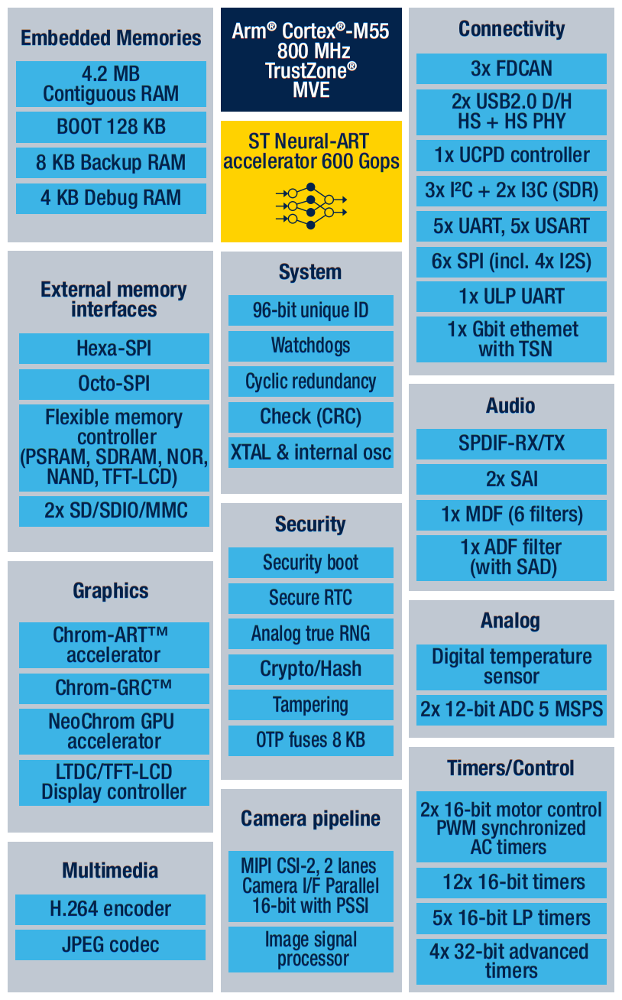

# STM32N6 介绍

[**STM32N6**](https://www.st.com/en/microcontrollers-microprocessors/stm32n6-series.html) 系列是 ST 推出的第一款内嵌 AI 加速器的高性能 STM32 MCU，它基于运行频率达 800MHz 的 ARM Cortex-M55 内核推出的高性能系列 MCU，是首款引入 Arm Helium 向量处理技术的 CPU，为标准 CPU 增添 DSP 处理能力。

STM32N6 是内嵌的 AI 加速器是 ST 自主研发的神经处理单元（ST Neural-ART accelerator™），专为节能型边缘 AI 应用而设计，其时钟频率高达 1GHz，计算性能可达 600GOPS，可为计算机视觉和音频应用提供实时神经网络推理能力。

