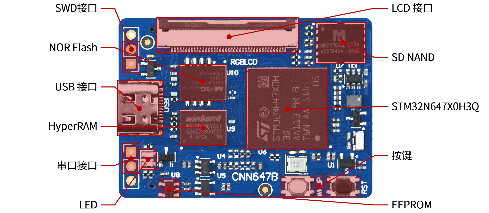

# STM32N647 开发板介绍

<!--  -->

STM32N647 开发板是正点原子以 STM32N647X0H3Q 为核心推出的开发板，开发板提供了强大的 AI 算力和 CPU 处理能力支持，可进行人工智能与机器听视觉的应用开发，同时，开发板板载丰富的存储器资源、多种传感器外设和通讯接口，非常适合用于 STM32N6 系列芯片的学习、开发和验证。

## 底板硬件资源

<!--  -->

| 硬件 | 描述 |
| --- | --- |
|  |  |

## 核心板硬件资源

| 硬件 | 描述 |
| --- | --- |
| STM32N647X0H3Q | ST 推出的基于ARM Cortex-M55 的高性能 MCU 800MHz 主频 内置 4.2MB SRAM 内置 600GPOS Neural-ART 加速器 内置 NeoChrom GPU、JPEG 编解码器、H-264 编码器 [**详细介绍**](./stm32n6-introduction.md) |
| NORFlash | 容量 32MB，Octo SPI 接口 |
| HyperRAM | 容量 32MB，HyperBus 接口 |
| SD NAND | 容量 2GB，4 Bits SD 接口 |
| LED | 蓝色 LED 为电源指示灯 红色 LED 为用户指示灯 |
| 按键 | 黑色按键为复位按键，作用与 MCU、NOR Flash、HyperRAM 和外接的 LCD 白色按键用户按键 |
| LCD 接口 | 用于连接正点原子4.3寸、7寸、10.1寸等不同尺寸和分辨率的RGB LCD屏模块 |
| USB 接口 | USB 2.0 接口，支持低速、全速和高速模式 支持 USB Host 和 USB Device 模式 |
| SWD 调试接口 | 可用于 MCU 的在线调试和固件烧录 |
| 串口接口 | 可用以与上位机或其他串口设备进行数据通讯 |